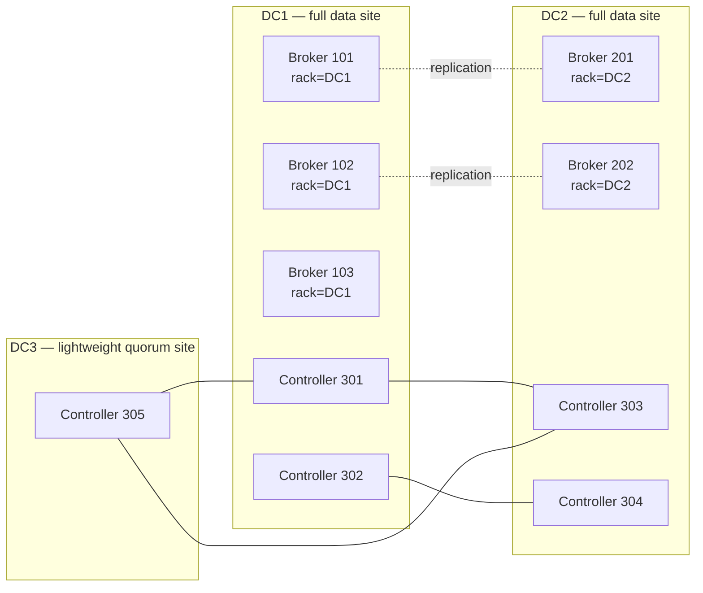
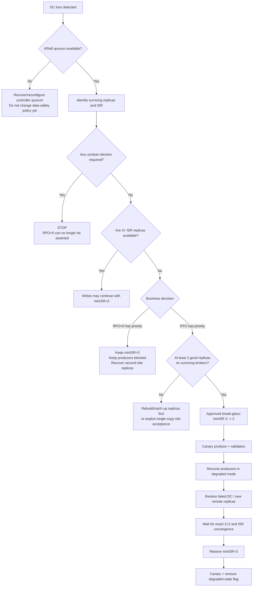

# Deterministic 2+2 Replica Placement and Operational DR with Apache Kafka Community

## Executive summary

**Yes: Apache Kafka Community can provide broker-level RPO=0 for acknowledged records in a stretched two-data-center cluster without Confluent Enterprise/MRC.** The key is to make the durability invariant explicit rather than relying on Kafka's default placement behavior:

\[
\textbf{RF}=4,\quad \textbf{placement}=2+2,\quad \textbf{minISR}=3,\quad \textbf{producer acks}=all
\]

With exactly two replicas of every partition in DC1 and two in DC2, `min.insync.replicas=3` has an important mathematical property: no single DC contains enough replicas to satisfy `minISR`. Therefore, every successful `acks=all` write requires an ISR that spans both data centers. Apache Kafka specifies that with `acks=all`, every current ISR member must acknowledge the write, and that writes fail if ISR size is below `min.insync.replicas`. citeturn27view0turn20view0

This yields the core safety invariant:

```text
Partition replica set = 2 × DC1 + 2 × DC2
Maximum replicas in one DC = 2

minISR = 3

Therefore:

successful write
    => ISR >= 3
    => ISR cannot exist entirely in one DC
    => at least one in-sync replica exists in each DC
    => acks=all receives ACK from that cross-DC ISR
```

That is sufficient for **RPO=0 against loss of either one data center, for records that the producer has successfully acknowledged**, subject to the fault model discussed below. This is the same fundamental durability condition Confluent documents for stretched clusters: `minISR` must exceed the number of synchronous replicas in any single data center, and producers must use `acks=all`. citeturn23view0turn23view1

What Community Kafka does **not** provide is Confluent MRC's declarative policy engine saying, effectively, “this topic must always have exactly two replicas in rack/DC1 and exactly two in rack/DC2.” Apache Kafka's built-in placer prioritizes even rack distribution, but Community's strongest deterministic mechanism is an **explicit broker-level replica assignment**, created and continuously validated by your own provisioning/DR tooling. Apache Kafka exposes manual assignments through `kafka-topics --replica-assignment` and explicit reassignment JSON through `kafka-reassign-partitions`. citeturn26view0turn20view4turn20view5

Accordingly, my recommendation for a Community implementation is:

| Requirement | Recommended Community implementation |
|---|---|
| Site-level broker RPO=0 | Exact `2+2`, RF=4, `minISR=3`, `acks=all` |
| Deterministic placement | External placement planner + explicit `--replica-assignment` / reassignment JSON |
| Placement enforcement | Continuous topology validator against broker-ID → DC inventory |
| DC network partition safety | `minISR=3`; never automatically downgrade it |
| Unclean election | Disabled; any use is a declared RPO violation |
| Producer safety | `acks=all`, idempotence enabled, retries enabled |
| KRaft availability | Dedicated 3- or preferably 5-controller quorum; for 2.5 DC, `2+2+1` is strong |
| Internal topics | RF=4 from inception; audit and explicitly reassign to 2+2 |
| DR with strict RPO=0 | Do **not** lower `minISR`; wait/rebuild cross-DC synchronous redundancy |
| DR with availability override | Controlled `minISR 3 → 2` only after explicit risk acceptance |
| Recovery back to protected state | Restore 2+2 first, verify ISR/DC coverage, then return `minISR=3` |
| Operational RTO | Community: principally determined by your automation/runbook; EE reduces this operational burden |

A lightweight third site containing only KRaft controllers is highly useful for **control-plane availability**, but it contributes no application-data replica. With five controllers distributed `2+2+1`, losing either full DC leaves three controllers and therefore a controller majority. Apache Kafka recommends typically three or five controllers and requires a majority for availability; Apache also recommends separating controller and broker roles in critical deployments. citeturn20view10turn23view8turn23view9

The crucial architectural distinction is therefore:

> **Community Kafka is sufficient for broker-level RPO=0. Confluent Enterprise/MRC is primarily buying declarative failure-domain placement, observers, automatic observer promotion, and operational automation that can materially reduce RTO and configuration risk.**

Confluent itself identifies follower fetching, observers and replica placement as the additional MRC capabilities, with Automatic Observer Promotion using replica-placement policies to restore ISR automatically in selected degraded states. citeturn22view0

One caveat must be explicit in any architecture decision record: “RPO=0” here means **no loss of successfully acknowledged records under the single-DC-failure model while at least one valid acknowledged copy survives**. It is not a proof against simultaneous destructive failure of both data centers, administrative deletion, storage corruption affecting all copies, incorrect producer configuration, or every surviving replica losing volatile data during correlated unclean power loss. Modern Kafka's Eligible Leader Replicas feature improves an important “last replica standing” failure mode; ELR exists from Kafka 4.0 and is enabled by default for new Kafka 4.1+ clusters. citeturn27view1


## Architecture and durability invariants

### Recommended stretched topology

The exact broker count was not specified in the current request. The design below therefore assumes **at least two data brokers in each full data center**. A 3+2 broker deployment works, but it has significant asymmetry discussed below. The optional third site contains controllers, not brokers.



For critical KRaft deployments, dedicated controller processes are preferable to combined `broker,controller` processes: Apache says combined mode is not recommended in critical environments because brokers and controllers cannot then be independently rolled or scaled. A five-controller quorum can tolerate two controller failures; a three-controller quorum tolerates one. citeturn23view8turn20view10

A Confluent-style 2.5-DC topology uses precisely this control-plane idea: two full data centers plus a lightweight third site with controller capacity. Confluent's current 2.5-DC recommendation uses five controllers distributed `2+2+1`. That recommendation is not technically dependent on Confluent Server; the underlying majority property is a KRaft/Raft property available in Apache Kafka. citeturn23view0turn20view10

### Why exact 2+2 plus minISR=3 works

Consider:

```text
Partition P0

DC1                         DC2
------------------          ------------------
Broker 101   replica        Broker 201   replica
Broker 102   replica        Broker 202   replica

RF = 4
minISR = 3
producer acks = all
```

In normal operation:

```text
ISR = [101, 102, 201, 202]
```

A producer using `acks=all` waits for the complete current ISR. Apache Kafka describes this as its strongest producer acknowledgment mode. citeturn20view0

If one broker disappears:

```text
ISR = [101, 201, 202]
```

`ISR=3`, so writes may continue. Every successful write still has replicas in both DCs. citeturn27view0

If DC1 disappears:

```text
DC1                         DC2
101  X                      201 OK
102  X                      202 OK

ISR <= 2
minISR = 3
```

A surviving in-sync replica can become leader, but new `acks=all` writes fail because ISR is below `minISR`. Apache specifies `NotEnoughReplicas` or `NotEnoughReplicasAfterAppend` in this condition. citeturn27view0

This is **intentional loss of write availability in order to preserve the site-level RPO=0 policy**.

The important point is that `minISR=3` is not merely “majority replication.” In an exact 2+2 topology it is a **geographic quorum constraint by construction**:

```text
No DC owns >= 3 replicas
             +
       minISR = 3
             =
any successful write requires both DCs
```

Kafka itself knows only broker IDs, replica sets and ISR. The geography is encoded indirectly by guaranteeing that no failure domain owns enough partition replicas to satisfy `minISR` alone. Apache provides the `min.insync.replicas` semantics; the geographic conclusion is an architectural inference from exact 2+2 placement. citeturn27view0

### Why minISR=2 is not equivalent

With:

```text
RF = 4
placement = 2 + 2
minISR = 2
acks = all
```

a WAN partition can produce:

```text
DC1                         DC2
101 ISR                     201 out of ISR
102 ISR                     202 out of ISR

ISR = [101,102]
```

Because `ISR=2` still satisfies `minISR=2`, DC1 may continue acknowledging writes. If DC1 then fails before DC2 catches up, those acknowledged records may not exist in DC2.

Therefore:

```text
RF4 + minISR2 + acks=all
```

is strong broker redundancy but **not a hard site-level RPO=0 invariant** for a 2+2 topology. The decisive property is that `minISR` must be greater than the maximum number of partition replicas in a single site. Confluent's current stretched-cluster guidance states the same condition explicitly. citeturn23view1

### The 3+2 broker-count problem

If the actual physical deployment is:

```text
DC1: B101 B102 B103
DC2: B201 B202
```

and every partition must contain exactly two replicas in each DC, then **every RF=4 partition necessarily exists on both DC2 brokers**:

```text
P0: 101 102 | 201 202
P1: 102 103 | 201 202
P2: 103 101 | 201 202
...
```

That is mathematically unavoidable because DC2 has exactly two eligible brokers. Consequently, both DC2 brokers carry a replica of every protected partition. This is not an RPO defect, but it creates capacity and maintenance concentration: either DC2 broker failure puts all protected partitions at `ISR=3`, and DC2 must be sized to host its half of the entire replicated data set. This conclusion follows directly from the exact 2+2 assignment requirement. Apache's placer itself attempts to spread replicas across racks and brokers, but it cannot invent additional brokers in the smaller failure domain. citeturn26view2turn26view3

For a serious stretched architecture I therefore prefer **symmetrical broker populations**—for example 3+3 or 4+4—even while keeping RF=4. The 2+2 replica rule can then rotate among several physical brokers in each site, reducing correlated maintenance exposure.


## Deterministic replica placement in Community Kafka

### Rack awareness is useful, but it is not the compliance mechanism

Configure every broker with `broker.rack`. Apache Kafka uses that value for rack-aware replica assignment. The Kafka 4.3 `StripedReplicaPlacer` explicitly gives its highest placement priority to spreading replicas as evenly as possible across racks and then tries to balance them across brokers. citeturn28view2turn26view2turn26view3

With only two rack values:

```properties
# DC1
broker.rack=DC1

# DC2
broker.rack=DC2
```

and RF=4, the standard placer is naturally aligned with a 2+2 distribution. However, for a formal RPO=0 control I would **not treat automatic placement as the compliance boundary**. Instead, generate the exact assignment externally, submit it explicitly, and continuously validate it. Apache exposes a manual `--replica-assignment` option specifically for partition-to-broker assignments. citeturn26view0turn26view1

A second design issue is that `broker.rack` is a single opaque string, not a hierarchical model of:

```text
DC → room → rack → host
```

If you encode:

```properties
broker.rack=DC1
```

you obtain site awareness but lose intra-site rack distinction from Kafka's perspective.

If you instead encode:

```properties
broker.rack=DC1-RACK-A
broker.rack=DC1-RACK-B
broker.rack=DC2-RACK-A
broker.rack=DC2-RACK-B
```

Kafka sees four independent rack identifiers; it does not understand the `DC1-` prefix as a separate higher-level failure domain. Therefore, for multi-level topology, the external placement planner should maintain its own broker metadata:

```yaml
101:
  dc: DC1
  rack: DC1-RACK-A
102:
  dc: DC1
  rack: DC1-RACK-B
201:
  dc: DC2
  rack: DC2-RACK-A
202:
  dc: DC2
  rack: DC2-RACK-B
```

The planner then enforces both `2 per DC` and, where possible, `2 different racks within each DC`. The statement about multi-level topology is an architectural inference from Apache's single-string `broker.rack` interface and rack-based placer. citeturn28view2turn26view2

### Broker ID and node ID practice

For contemporary KRaft Kafka, `node.id` is the required process identifier when `process.roles` is set. Kafka 4.3 still documents `broker.id`, but `node.id` is the explicit KRaft identity. citeturn28view0turn28view1

I recommend making location obvious operationally:

```text
DC1 brokers:       101, 102, 103, ...
DC2 brokers:       201, 202, 203, ...
KRaft controllers: 301, 302, 303, 304, 305
```

The numeric ranges are not a Kafka requirement; they are an operational convention that makes placement plans, incident output and peer review considerably easier.

For a KRaft broker:

```properties
process.roles=broker
node.id=101
broker.rack=DC1
```

For a dedicated controller:

```properties
process.roles=controller
node.id=301
```

Do not casually recycle retired IDs during DR. The safer operational policy is to treat node identities as durable infrastructure identities until all old replica assignments, storage directories and operational records referring to them have been reconciled.

### Explicit topic creation

Apache Kafka 4.3 accepts manual assignments in this format:

```text
broker_for_p0_r0:broker_for_p0_r1:...,
broker_for_p1_r0:broker_for_p1_r1:...,
...
```

The TopicCommand implementation defines `--replica-assignment` exactly this way; when manual assignment is supplied for topic creation, `--partitions` and `--replication-factor` are not used alongside it. citeturn26view0turn26view1

For a 3+2 broker example:

```text
DC1 = 101,102,103
DC2 = 201,202
```

a six-partition assignment can be:

```bash
ASSIGNMENT='101:201:102:202,\
201:102:202:103,\
103:202:101:201,\
202:101:201:102,\
102:201:103:202,\
201:103:202:101'

bin/kafka-topics.sh \
  --bootstrap-server kafka1.dc1.example:9092 \
  --create \
  --topic payments \
  --replica-assignment "${ASSIGNMENT}" \
  --config min.insync.replicas=3 \
  --config unclean.leader.election.enable=false
```

Every partition has:

```text
2 unique DC1 brokers
+
2 unique DC2 brokers
```

and the ordering can be rotated so that preferred leadership is not concentrated in one site or one broker.

Immediately validate:

```bash
bin/kafka-topics.sh \
  --bootstrap-server kafka1.dc1.example:9092 \
  --describe \
  --topic payments
```

Also validate the dangerous conditions Kafka 4.3's TopicCommand exposes directly:

```bash
bin/kafka-topics.sh \
  --bootstrap-server kafka1.dc1.example:9092 \
  --describe \
  --under-replicated-partitions

bin/kafka-topics.sh \
  --bootstrap-server kafka1.dc1.example:9092 \
  --describe \
  --under-min-isr-partitions

bin/kafka-topics.sh \
  --bootstrap-server kafka1.dc1.example:9092 \
  --describe \
  --at-min-isr-partitions

bin/kafka-topics.sh \
  --bootstrap-server kafka1.dc1.example:9092 \
  --describe \
  --unavailable-partitions
```

Kafka 4.3's TopicCommand includes these under-replicated, under-min-ISR, at-min-ISR and unavailable-partition filters. citeturn26view1

### A deterministic placement generator

For Community Kafka, I would put the assignment algorithm under source control and make it the only authorized topic-creation path for RPO-0 topics.

A minimal generator:

```python
#!/usr/bin/env python3

import argparse
import json
from typing import List


def parse_ids(value: str) -> List[int]:
    ids = [int(x.strip()) for x in value.split(",") if x.strip()]
    if len(set(ids)) != len(ids):
        raise ValueError("Broker IDs must be unique within each DC")
    if len(ids) < 2:
        raise ValueError("At least two brokers per DC are required for 2+2")
    return ids


def assignment_for_partition(
    partition: int,
    dc1: List[int],
    dc2: List[int],
) -> List[int]:
    # Rotate broker selection independently in each DC.
    a1 = dc1[partition % len(dc1)]
    a2 = dc1[(partition + 1) % len(dc1)]

    b1 = dc2[partition % len(dc2)]
    b2 = dc2[(partition + 1) % len(dc2)]

    if a1 == a2 or b1 == b2:
        raise RuntimeError("2+2 requires two distinct brokers in each DC")

    # Alternate the first replica to avoid putting all preferred
    # replica positions in one DC.
    if partition % 2 == 0:
        replicas = [a1, b1, a2, b2]
    else:
        replicas = [b1, a1, b2, a2]

    if len(set(replicas)) != 4:
        raise RuntimeError(f"Duplicate broker in partition {partition}")

    return replicas


def main() -> None:
    parser = argparse.ArgumentParser()
    parser.add_argument("--topic", required=True)
    parser.add_argument("--partitions", required=True, type=int)
    parser.add_argument("--dc1", required=True, help="e.g. 101,102,103")
    parser.add_argument("--dc2", required=True, help="e.g. 201,202,203")
    parser.add_argument(
        "--format",
        choices=["reassignment", "create"],
        default="reassignment",
    )
    args = parser.parse_args()

    dc1 = parse_ids(args.dc1)
    dc2 = parse_ids(args.dc2)

    assignments = [
        assignment_for_partition(p, dc1, dc2)
        for p in range(args.partitions)
    ]

    if args.format == "create":
        print(",".join(":".join(map(str, r)) for r in assignments))
    else:
        document = {
            "version": 1,
            "partitions": [
                {
                    "topic": args.topic,
                    "partition": p,
                    "replicas": assignments[p],
                }
                for p in range(args.partitions)
            ],
        }
        print(json.dumps(document, indent=2))


if __name__ == "__main__":
    main()
```

Usage:

```bash
python3 placement.py \
  --topic payments \
  --partitions 24 \
  --dc1 101,102,103 \
  --dc2 201,202 \
  --format create
```

For existing topics:

```bash
python3 placement.py \
  --topic payments \
  --partitions 24 \
  --dc1 101,102,103 \
  --dc2 201,202 \
  --format reassignment \
  > payments-2plus2.json
```

The generated JSON is directly compatible with Apache Kafka's documented custom reassignment model, where the administrator explicitly supplies the replica list for each partition. citeturn27view6

In a real implementation, extend this planner to incorporate partition sizes, broker disk utilization, rack-within-DC diversity, preferred-leader distribution and a stable assignment algorithm so that adding a broker does not unnecessarily rewrite every partition.

### Reassignment of an existing topic

An explicit plan:

```json
{
  "version": 1,
  "partitions": [
    {
      "topic": "payments",
      "partition": 0,
      "replicas": [101, 201, 102, 202]
    },
    {
      "topic": "payments",
      "partition": 1,
      "replicas": [201, 102, 202, 103]
    }
  ]
}
```

Execute:

```bash
bin/kafka-reassign-partitions.sh \
  --bootstrap-server kafka1.dc1.example:9092 \
  --reassignment-json-file payments-2plus2.json \
  --execute
```

Verify:

```bash
bin/kafka-reassign-partitions.sh \
  --bootstrap-server kafka1.dc1.example:9092 \
  --reassignment-json-file payments-2plus2.json \
  --verify
```

Apache explicitly supports custom hand-crafted assignments and documents `generate`, `execute` and `verify` as the three reassignment modes. It also instructs the operator to preserve the old assignment emitted by `--execute` for rollback. citeturn20view5turn27view6

For large movements, throttle explicitly:

```bash
bin/kafka-reassign-partitions.sh \
  --bootstrap-server kafka1.dc1.example:9092 \
  --reassignment-json-file payments-2plus2.json \
  --execute \
  --throttle 50000000
```

Then:

```bash
bin/kafka-reassign-partitions.sh \
  --bootstrap-server kafka1.dc1.example:9092 \
  --reassignment-json-file payments-2plus2.json \
  --verify
```

Apache warns that a throttle below the incoming write rate can prevent replica migration from converging, and `--verify` is important because it removes completed reassignment throttles. citeturn20view6

### Internal topics are part of the RPO design

A surprisingly common failure is:

```text
business topics             = RF4, 2+2, minISR3
__consumer_offsets          = RF3 / uncontrolled placement
__transaction_state         = RF3 / uncontrolled placement
```

Kafka 4.3 defaults both the consumer-offset and transaction-state internal topics to RF=3, while `default.replication.factor` itself defaults to 1. The transaction state log has a separate default `transaction.state.log.min.isr=2`. Those defaults do not satisfy an RF4/minISR3 stretched-cluster policy. citeturn26view6turn26view7turn26view8turn29view2

Therefore set before production use:

```properties
default.replication.factor=4

offsets.topic.replication.factor=4

transaction.state.log.replication.factor=4
transaction.state.log.min.isr=3
```

If Kafka 4.3 Share Groups are in use, their state topic has separate RF and minISR defaults—RF=3 and minISR=2—so the same design review applies. citeturn29view3

Community Kafka does not provide Confluent MRC's dedicated internal-topic placement constraints. Let Kafka create the internal topics with RF=4, then **audit their actual assignment and explicitly reassign them to validated 2+2 placement before declaring the system RPO-0 compliant**. Confluent MRC, by contrast, provides distinct defaults for regular topics, `__consumer_offsets`, and the transaction-state log. citeturn22view0


## Broker and client configuration baseline

### Broker `server.properties`

The following is an architectural baseline, not a universal tuning template. Listener names, TLS/SASL, storage paths, thread counts and WAN-related timeouts must be sized for the actual environment.

DC1 broker:

```properties
############################
# Identity / roles
############################

process.roles=broker
node.id=101

# Site is the Kafka rack failure domain in this simple model.
broker.rack=DC1


############################
# KRaft control plane
############################

controller.listener.names=CONTROLLER

# Kafka 4.1+ dynamic quorum style:
controller.quorum.bootstrap.servers=\
controller301.dc1.example:9093,\
controller302.dc1.example:9093,\
controller303.dc2.example:9093,\
controller304.dc2.example:9093,\
controller305.dc3.example:9093


############################
# Broker networking
############################

listeners=INTERNAL://0.0.0.0:9092,REPLICATION://0.0.0.0:9094

advertised.listeners=\
INTERNAL://broker101.dc1.example:9092,\
REPLICATION://broker101.dc1.example:9094

listener.security.protocol.map=\
INTERNAL:SSL,\
REPLICATION:SSL,\
CONTROLLER:SSL

inter.broker.listener.name=REPLICATION


############################
# Topic safety defaults
############################

auto.create.topics.enable=false
default.replication.factor=4

min.insync.replicas=3
unclean.leader.election.enable=false


############################
# Kafka internal state
############################

offsets.topic.replication.factor=4

transaction.state.log.replication.factor=4
transaction.state.log.min.isr=3

# If Share Groups are used:
share.coordinator.state.topic.replication.factor=4
share.coordinator.state.topic.min.isr=3


############################
# Replication
############################

# Defaults shown explicitly; tune only after measurement.
replica.fetch.wait.max.ms=500
replica.lag.time.max.ms=30000

# Benchmark before increasing.
num.replica.fetchers=1
```

DC2 differs primarily in identity and rack:

```properties
process.roles=broker
node.id=201
broker.rack=DC2
```

Apache documents `broker.rack` as the input for rack-aware replication, `default.replication.factor` as the default for automatic/AdminClient-created topics, `min.insync.replicas` as the durability threshold, and `unclean.leader.election.enable=false` as the default safety posture. citeturn28view2turn26view6turn27view0turn28view4

`auto.create.topics.enable` defaults to true in Kafka 4.3, so setting it to false is important for a deterministic environment: an accidentally auto-created topic should not bypass the provisioning and validation pipeline. citeturn28view3

`replica.fetch.wait.max.ms` defaults to 500 ms and should remain below `replica.lag.time.max.ms`; the latter defaults to 30 seconds and determines how long a follower may stop fetching/catching up before the leader removes it from ISR. citeturn26view4turn26view5

For a stretched cluster, I would not blindly increase `replica.lag.time.max.ms` to mask an unstable WAN. A higher value delays ISR removal; a low value can create ISR flapping. The correct number should be justified by measured cross-DC tail latency, packet-loss behavior and the produce latency SLO.

Similarly, `num.replica.fetchers` is a performance knob rather than a correctness knob. Apache notes that increasing it can increase follower/leader I/O parallelism at the cost of CPU and memory. Benchmark recovery throughput before changing it. citeturn28view6

### Producer settings

Tier-0 producers should use:

```properties
acks=all
enable.idempotence=true

# Explicit for auditability, although modern clients have strong defaults.
retries=2147483647
max.in.flight.requests.per.connection=5
```

Kafka 4.3 documents `acks=all` as waiting for the complete ISR and providing the strongest available acknowledgment guarantee. Idempotence requires `acks=all`, retries greater than zero and at most five in-flight requests per connection; idempotence is enabled by default unless conflicting options disable it. citeturn20view0turn20view1

Idempotence should not be confused with the RPO guarantee:

```text
acks=all + minISR + placement
    -> durability

enable.idempotence
    -> retry deduplication / ordering safety
```

Both are desirable, but they solve different problems. citeturn20view0turn20view1

For a stretched cluster, `request.timeout.ms` and `delivery.timeout.ms` must be sized from observed WAN-inclusive produce latency. Because `acks=all` includes follower acknowledgment, the inter-DC replication path is directly visible in producer latency; Kafka exposes `RemoteTimeMs` precisely for the time a produce request waits for follower replication. citeturn30view5turn30view6

A DR canary test can use:

```bash
bin/kafka-producer-perf-test.sh \
  --topic dr-canary \
  --num-records 100000 \
  --record-size 512 \
  --throughput -1 \
  --producer-props \
    bootstrap.servers=broker101.dc1.example:9092,broker201.dc2.example:9092 \
    acks=all \
    enable.idempotence=true
```

Treat this as a smoke/load test rather than a proof of RPO. The proof comes from configuration plus verified replica/ISR topology.

### Consumer settings

Consumers do not determine write durability, but their configuration affects failover behavior.

For transactional data:

```properties
isolation.level=read_committed
```

Kafka defines `read_committed` as returning only committed transactional records; the default `read_uncommitted` may return records from aborted transactions. citeturn20view3

Optional rack-aware reads:

```properties
client.rack=DC1
```

and broker-side:

```properties
replica.selector.class=org.apache.kafka.common.replica.RackAwareReplicaSelector
```

Apache exposes `client.rack` as a client location corresponding to `broker.rack`, and the broker supports a `ReplicaSelector` for preferred read replicas. Confluent's MRC documentation notes that the rack-aware selector and `client.rack` mechanism works with Apache Kafka clients and can direct consumption to local followers. citeturn20view2turn28view5turn22view0

Follower fetching is a latency/WAN optimization, **not part of the RPO=0 proof**.

### Controller configuration for the lightweight third site

A controller-only node:

```properties
process.roles=controller
node.id=305

listeners=CONTROLLER://0.0.0.0:9093
advertised.listeners=CONTROLLER://controller305.dc3.example:9093
controller.listener.names=CONTROLLER

controller.quorum.bootstrap.servers=\
controller301.dc1.example:9093,\
controller302.dc1.example:9093,\
controller303.dc2.example:9093,\
controller304.dc2.example:9093,\
controller305.dc3.example:9093
```

Kafka 4.3 supports dynamic KRaft controller membership and provides `kafka-metadata-quorum.sh` to inspect it. Apache requires a majority of controllers for control-plane availability. citeturn23view9turn27view5

Check quorum health with:

```bash
bin/kafka-metadata-quorum.sh \
  --bootstrap-server broker201.dc2.example:9092 \
  describe --status
```

The output includes leader ID, metadata high watermark, current voters and maximum follower lag. citeturn27view5


## Monitoring, alerting, and continuous proof of placement

For a Community implementation, monitoring is not simply observability. It is part of the **compensating control for the absence of declarative MRC placement constraints**.

The monitoring design should answer four independent questions continuously:

```text
1. Does every protected partition still have exactly 2 replicas in each DC?
2. Does the ISR currently satisfy the RPO invariant?
3. Can the KRaft quorum survive/is it surviving the expected failure?
4. Is WAN replication converging fast enough to prevent ISR degradation?
```

### Dashboard for durability state

Apache's own expected normal values are zero for `UnderReplicatedPartitions`, `UnderMinIsrPartitionCount`, `AtMinIsrPartitionCount`, `OfflineReplicaCount`, failed ISR updates and unclean leader elections. citeturn20view7turn23view4turn20view9turn23view7

Recommended panels:

| Signal | Kafka metric | Healthy target | Recommended operational alert |
|---|---|---:|---|
| Partitions below minISR | `kafka.server:type=ReplicaManager,name=UnderMinIsrPartitionCount` | `0` | **Critical immediately**, e.g. >0 for two scrape intervals |
| Partitions exactly at minISR | `...name=AtMinIsrPartitionCount` | `0` | High if >0 for 30–60 s outside maintenance |
| Under-replicated partitions | `...name=UnderReplicatedPartitions` | `0` | High after one `replica.lag.time.max.ms` interval; critical if growing |
| Offline partitions | `kafka.controller:type=KafkaController,name=OfflinePartitionsCount` | `0` | **Critical immediately** |
| Offline log dirs | `kafka.log:type=LogManager,name=OfflineLogDirectoryCount` | `0` | Critical |
| Unclean elections | `kafka.controller:type=ControllerStats,name=UncleanLeaderElectionsPerSec` | `0` | **Critical on any event** |
| ISR shrinks | `...name=IsrShrinksPerSec` | `0` normally | Warn on unexpected burst |
| ISR expands | `...name=IsrExpandsPerSec` | Tracks recovery | Alert if shrink is not followed by convergence |
| Failed ISR updates | `...name=FailedIsrUpdatesPerSec` | `0` | High/critical |
| Replica max lag | `kafka.server:type=ReplicaFetcherManager,name=MaxLag,clientId=Replica` | Around max produce batch magnitude | Alert on sustained/rising lag |
| Replication traffic | `ReplicationBytesInPerSec`, `ReplicationBytesOutPerSec` | workload-dependent | Capacity trend against WAN |
| Produce follower wait | `RequestMetrics/.../RemoteTimeMs,request=Produce` | SLO-dependent | Alert on p95/p99 deviation |
| Network idle | `NetworkProcessorAvgIdlePercent` | Apache says ideally >0.3 | Capacity warning below baseline |

The JMX names and Apache normal values are documented by Kafka; the durations above are **recommended operational policy**, not Kafka defaults. citeturn27view3turn23view4turn23view5turn23view7turn30view4turn30view5turn30view7

A useful P0 composite alert is:

```text
PRODUCERS_ACTIVE
AND
(
    UnderMinIsrPartitionCount > 0
    OR OfflinePartitionsCount > 0
    OR cross_dc_isr_coverage_failures > 0
    OR UncleanLeaderElectionsPerSec > 0
)
```

### The metric Kafka does not give you: geographic compliance

The most important custom metric in Community Kafka is something like:

```text
kafka_partition_replica_placement_noncompliant_total
kafka_partition_isr_site_coverage_noncompliant_total
```

For every Tier-0 partition, your validator should calculate:

```text
assigned replicas:
    count(DC1) == 2
    count(DC2) == 2
    unique brokers == 4

normal protected state:
    ISR size >= 3

while writes are allowed under RPO=0 policy:
    ISR contains >= 1 broker from DC1
    ISR contains >= 1 broker from DC2
```

The last condition follows automatically from exact2+2 plus `minISR=3`, but explicitly monitoring it catches accidental placement drift before it becomes a latent DR defect. Apache's rack-aware placement aims for balanced rack distribution, but an external validator is what turns that intent into an auditable deterministic requirement. citeturn26view2turn27view0

A production validator should query `AdminClient` rather than parse CLI text, map broker IDs to an authoritative DC inventory, and export the result to the monitoring system.

### WAN/recovery dashboard

For stretched Kafka, I would devote a separate dashboard to:

```text
Produce TotalTimeMs
Produce RemoteTimeMs
FetchFollower TotalTimeMs
ReplicationBytesInPerSec
ReplicationBytesOutPerSec
ReplicaFetcherManager MaxLag
ISR shrinks / expands
UnderReplicatedPartitions
network packet loss / retransmits
WAN utilization and RTT
reassignment FetcherLagMetrics
```

Apache explicitly exposes replication byte rates, follower-related request timing and replica lag metrics. During reassignment, Apache recommends monitoring `FetcherLagMetrics ... ConsumerLag` and ensuring the lag decreases; otherwise the migration throttle may be too restrictive. citeturn30view4turn30view5turn20view6

I would set WAN capacity alarms relative to engineered link capacity rather than a universal Kafka value—for example, a warning when replication consumes roughly 70% of the engineered replication bandwidth for a sustained period and critical around 85%, adjusted to your burst model. Those percentages are planning recommendations, not Apache defaults.

### KRaft dashboard

Monitor:

```text
ActiveControllerCount
ActiveBrokerCount
FencedBrokerCount
OfflinePartitionsCount
MetadataErrorCount
Raft average/max commit latency
Raft average/max election latency
metadata quorum MaxFollowerLag
metadata quorum voter membership
```

Kafka 4.3 exposes those controller and Raft metrics, while `kafka-metadata-quorum.sh describe --status` gives the runtime quorum composition and lag. citeturn27view4turn27view5

For a 2+2+1 controller topology, an alarm should explicitly model:

```text
available controller voters < 3 of 5
```

as loss of control-plane quorum. The threshold follows directly from Apache's majority requirement. citeturn20view10

### Eligible Leader Replicas in modern Kafka

If the target Community version is Kafka 4.1+ and the cluster was created with ELR enabled, include ELR in the operational model. Kafka 4.3 documents that ELR is enabled by default for new clusters beginning in 4.1 and allows certain replicas outside the current ISR to remain eligible for safe leader election based on the strict minISR/high-watermark model. citeturn27view1

This is relevant to DR because Kafka also documents a critical side effect:

> changing cluster-level or topic-level `min.insync.replicas` clears ELR state.

Therefore, a break-glass operation that lowers:

```text
minISR 3 → 2
```

is not merely a simple availability toggle on modern ELR-enabled Kafka. It alters the durability threshold **and clears ELR state for the affected scope**. This needs to be in the change record and DR runbook. citeturn27view2


## Operational DR playbook

### The governing rule

The DR runbook must distinguish two business decisions that are sometimes incorrectly merged:

```text
A. Preserve strict site-level RPO=0
or
B. Resume writes before cross-site protection has been restored
```

After complete loss of one data DC in an exact2+2/minISR3 design, you cannot have both simultaneously.



### Initial incident actions

On suspected full-DC failure:

```bash
bin/kafka-metadata-quorum.sh \
  --bootstrap-server broker201.dc2.example:9092 \
  describe --status
```

Then:

```bash
bin/kafka-topics.sh \
  --bootstrap-server broker201.dc2.example:9092 \
  --describe \
  --unavailable-partitions

bin/kafka-topics.sh \
  --bootstrap-server broker201.dc2.example:9092 \
  --describe \
  --under-min-isr-partitions

bin/kafka-topics.sh \
  --bootstrap-server broker201.dc2.example:9092 \
  --describe \
  --under-replicated-partitions
```

The metadata-quorum tool and partition-state commands are standard Kafka operational interfaces. citeturn27view5turn26view1

Then capture, before changing anything:

```text
controller quorum state
broker active/fenced state
topic assignments
leader and ISR per partition
minISR overrides
current reassignment operations
ELR information, if supported/enabled
application error rates
last known WAN status
```

This is especially important with ELR because changing `min.insync.replicas` clears corresponding ELR state. citeturn27view2

### Strict RPO=0 branch

Suppose DC1 is completely gone and only:

```text
201,202
```

remain for a partition.

With:

```text
minISR=3
```

**do nothing to minISR**.

The surviving ISR replica may be leader, but producers receive insufficient-replica errors. That is correct behavior: Kafka refuses to create new acknowledged records that no longer meet the cross-DC durability policy. citeturn27view0

The recovery sequence is:

```text
DC recovered/new remote brokers available
       ↓
reassign/restart missing replicas
       ↓
replicas fetch/catch up
       ↓
ISR grows
       ↓
validate exact 2+2
       ↓
validate ISR >= 3 and cross-DC ISR coverage
       ↓
canary
       ↓
resume producers
```

This branch maintains the broker-level RPO=0 claim. Its RTO is fundamentally **the time needed to restore sufficient synchronous replicas**, so it is not near-zero Community DR unless replacement capacity is already available in another data failure domain.

### Availability-over-RPO break-glass branch

If management decides that restarting writes matters more than maintaining two-site synchronous protection, lower minISR only for the explicitly approved topics:

```bash
bin/kafka-configs.sh \
  --bootstrap-server broker201.dc2.example:9092 \
  --alter \
  --entity-type topics \
  --entity-name payments \
  --add-config min.insync.replicas=2
```

Then verify:

```bash
bin/kafka-configs.sh \
  --bootstrap-server broker201.dc2.example:9092 \
  --describe \
  --entity-type topics \
  --entity-name payments
```

With two surviving in-sync replicas:

```text
ISR = [201,202]
minISR = 2
acks = all
```

the two brokers must both acknowledge writes. This gives good **intra-surviving-site broker durability**, but site-level RPO=0 is no longer true because there is no synchronous copy in another data center. The behavior follows directly from Kafka's minISR/acks rules. citeturn27view0turn20view0

This should produce an explicit operational state such as:

```text
CLUSTER_STATE = DEGRADED_SINGLE_SITE
SITE_RPO0_GUARANTEE = FALSE
MIN_ISR_OVERRIDE = 2
CHANGE_ID = INC-12345
```

I strongly recommend **not automatically lowering minISR solely because monitoring detects a DC failure**. An automatic downgrade converts an availability event into a durability-policy change without human confirmation and makes certain network-partition scenarios much more dangerous.

With Kafka 4.1+ ELR, also remember that changing topic `min.insync.replicas` clears that topic's ELR state. citeturn27view2

### If only one usable replica survives

Do not automatically do:

```text
minISR=1
```

for an RPO-sensitive service.

That is single-copy operation. A subsequent broker/storage failure can lose newly acknowledged data. The safer branch is:

```text
one valid replica
    ↓
keep writes blocked
    ↓
provision another broker
    ↓
reassign/catch up replica
    ↓
verify caught up / ISR
    ↓
only then consider minISR=2
```

The risk statement follows directly from Kafka's acknowledgment semantics: with `acks=all`, safety is conditional on surviving in-sync replicas. citeturn20view0

### Rebuilding replication in the surviving site

Assume a 3+2 topology and DC2 is lost. DC1 still has brokers:

```text
101,102,103
```

You cannot reproduce RF=4 on three brokers because Kafka cannot assign multiple replicas of one partition to the same broker. You can temporarily build three synchronous copies in the surviving site, or add at least one more broker. Apache's manual reassignment format lets you specify the desired replica list explicitly. citeturn27view6

Example temporary assignment:

```json
{
  "version": 1,
  "partitions": [
    {
      "topic": "payments",
      "partition": 0,
      "replicas": [101, 102, 103]
    }
  ]
}
```

Execute:

```bash
bin/kafka-reassign-partitions.sh \
  --bootstrap-server broker101.dc1.example:9092 \
  --reassignment-json-file temporary-single-site.json \
  --execute \
  --throttle 100000000
```

Monitor convergence and then:

```bash
bin/kafka-reassign-partitions.sh \
  --bootstrap-server broker101.dc1.example:9092 \
  --reassignment-json-file temporary-single-site.json \
  --verify
```

Apache documents both custom reassignment and bandwidth throttling, and warns to ensure the throttle is above the effective incoming data rate so that recovery can make progress. citeturn27view6turn20view6

Again, this restores broker redundancy but **not cross-site RPO=0**.

### Restoring 2+2 after the failed DC returns

The safest order is:

```text
1. Failed-site brokers are stable.
2. WAN is stable.
3. Reassign exact 2+2.
4. Wait for all remote replicas to catch up.
5. Verify assignment.
6. Verify ISR geographically.
7. Restore minISR=3.
8. Run canary.
9. Resume/normalize production state.
```

Do not raise the “RPO=0 restored” flag merely because the brokers have started. A remote replica that is still catching up does not yet prove cross-site synchronous protection.

Generate the desired plan:

```bash
python3 placement.py \
  --topic payments \
  --partitions 24 \
  --dc1 101,102,103 \
  --dc2 201,202 \
  > payments-restore-2plus2.json
```

Execute and verify:

```bash
bin/kafka-reassign-partitions.sh \
  --bootstrap-server broker101.dc1.example:9092 \
  --reassignment-json-file payments-restore-2plus2.json \
  --execute \
  --throttle 100000000

bin/kafka-reassign-partitions.sh \
  --bootstrap-server broker101.dc1.example:9092 \
  --reassignment-json-file payments-restore-2plus2.json \
  --verify
```

Kafka's reassignment tooling supports exactly this explicit migration workflow. citeturn20view5turn20view6

Then restore:

```bash
bin/kafka-configs.sh \
  --bootstrap-server broker101.dc1.example:9092 \
  --alter \
  --entity-type topics \
  --entity-name payments \
  --add-config min.insync.replicas=3
```

On ELR-enabled Kafka, that update again clears affected ELR state, so include this in the post-change verification. citeturn27view2

### Safe producer-resume gate

I would implement the producer-resume gate as a machine-checkable policy:

```text
MUST all be true:

[ ] KRaft quorum healthy
[ ] Active controller present
[ ] no unavailable/offline protected partitions
[ ] no unclean leader election occurred
[ ] no active unexpected reassignment
[ ] intended minISR configuration confirmed
[ ] every protected partition has required assignment
[ ] every protected partition has ISR >= minISR
[ ] strict mode: every ISR spans DC1 + DC2
[ ] strict mode: every assignment is exactly 2+2
[ ] replica lag is stable/converged
[ ] produce canary succeeds with acks=all
[ ] consumer canary observes expected record
```

Only after those checks should normal producers be unfenced/unpaused.

Example canary:

```bash
bin/kafka-producer-perf-test.sh \
  --topic dr-canary \
  --num-records 10000 \
  --record-size 512 \
  --throughput 1000 \
  --producer-props \
    bootstrap.servers=broker101.dc1.example:9092,broker201.dc2.example:9092 \
    acks=all \
    enable.idempotence=true
```

During the test watch `UnderMinIsrPartitionCount`, `AtMinIsrPartitionCount`, `UnderReplicatedPartitions`, produce `RemoteTimeMs`, failed produce requests and replica lag. Kafka exposes these metrics specifically for replication/request health. citeturn27view3turn23view4turn30view5

### Unclean leader election: why it is excluded

Keep:

```properties
unclean.leader.election.enable=false
```

Apache describes unclean election as allowing a non-ISR replica to become leader as a last resort **even though data loss may result**. citeturn28view4

Therefore the DR semantics should be:

```text
CLEAN election
    -> compatible with RPO=0 claim

UNCLEAN election
    -> availability recovery mechanism
    -> RPO=0 claim is immediately invalid
    -> incident becomes data-consistency/data-loss investigation
```

Do not write an “unclean election” step into the normal RPO=0 playbook.

It belongs in a separate catastrophic-recovery procedure where the business has explicitly accepted possible loss of previously acknowledged data. Confluent's documentation is equally explicit that an unclean election can truncate a log to an offset earlier than the highest previously acknowledged offset. citeturn22view0

### Indicative DR action/RTO table

These are **engineering planning ranges, not Kafka guarantees**. Real values depend on failure-detection policy, application retries, broker count, partition count, network RTT/loss, data volume, storage throughput, WAN bandwidth and whether replacement infrastructure is pre-provisioned.

| DR action | Data-safety effect | Indicative incremental RTO impact | Automation recommendation |
|---|---|---:|---|
| Detect/fence failed DC | None if configuration unchanged | ~10 s–2 min target | Automate detection; be conservative on declaring site loss |
| Verify KRaft quorum | None | Seconds–1 min | Automate |
| Capture assignment/ISR/config/ELR state | None | <1–3 min | Automate |
| Clean leader election on surviving ISR | Preserves acknowledged data | Usually automatic; seconds-scale control action once failure is established | Kafka automatic |
| Keep `minISR=3` | Preserves strict site-level RPO=0 | RTO depends on DC/replacement recovery | Default strict policy |
| Lower `minISR 3→2` | **Drops site-level protection** | Seconds technically; ~1–5 min with approval/validation | Human-approved break glass |
| Canary `acks=all` | No intentional reduction | ~1–5 min | Automate |
| Resume producers on two surviving replicas | Degraded single-site protection | Application dependent | Controlled orchestration |
| Reassign to existing spare brokers | Improves broker redundancy | Minutes to hours | Planner automated, execution controlled |
| Provision new brokers | Improves capacity/redundancy | Infrastructure dependent | Automate where possible |
| Rehydrate failed site's replicas | Restores geographic copies | Minutes to many hours | Automate movement, monitor lag |
| Validate exact 2+2 | Required for strict policy | Seconds–minutes | Fully automate |
| Restore `minISR=3` | Restores geographic write constraint after 2+2 exists | Seconds–minutes | Automated after explicit gate |
| Preferred-leader rebalance | Restores intended leader distribution | Usually seconds–minutes | Controlled after data recovery |

Apache's documented mechanisms support automatic clean leader election, explicit reassignment and throttled migration, but Community's administrator is responsible for constructing the actual reassignment plan and deciding when to execute it. citeturn20view5turn20view6


## Community versus Confluent Enterprise/MRC

The distinction should not be framed as:

```text
Community = cannot do RPO0
Enterprise = can do RPO0
```

That is technically inaccurate.

The more precise distinction is:

```text
Apache Kafka Community
    = replication primitives + rack awareness
      + explicit broker assignments
      + operator-owned policy/automation

Confluent MRC
    = replication primitives
      + declarative replica-placement policy
      + observers
      + automatic observer promotion
      + additional MRC operational tooling
```

Confluent itself says Confluent Server adds follower fetching, observers and replica placement for MRC and documents replica-placement JSON that can require exact replica counts per rack. citeturn22view0

| Capability relevant to this design | Apache Kafka Community | Confluent Platform MRC / EE value |
|---|---|---|
| `acks=all` synchronous ISR acknowledgment | **Yes** | Yes |
| `min.insync.replicas` | **Yes** | Yes |
| RF=4 | **Yes** | Yes |
| `broker.rack` rack awareness | **Yes** | Yes |
| Built-in rack-spreading assignment | **Yes** | Yes |
| Exact manual `2+2` broker assignment | **Yes** via `--replica-assignment` / reassignment JSON | Yes |
| Declarative policy “2 replicas rack/DC1 + 2 rack/DC2” | **No equivalent core policy object**; external planner required | **Yes**, Replica Placement Constraints |
| Fail topic creation when site-count policy cannot be satisfied | Requires external validation | **Built into replica-placement constraint behavior** |
| Observer replica type | No | **Yes** |
| Automatic Observer Promotion | No | **Yes** |
| Rack-local follower reads | **Yes**, via Kafka replica selector/client rack mechanisms | Yes |
| Modern ELR safe-leader mechanism | **Yes in Apache Kafka 4.x** | Depends on bundled Kafka/version |
| KRaft controller-only third site | **Yes** | Yes |
| 5-controller `2+2+1` quorum | **Yes** | Yes |
| Exact internal-topic geographic placement policy | External audit/reassignment | Dedicated MRC placement settings for offsets and transaction state |
| Automatic policy-aware replica relocation | Not in Kafka core; external tooling required | Confluent rebalance/self-balancing capabilities |
| DC-loss strict-RPO behavior | Writes stop at `ISR<3` | Same underlying safety principle |
| Automatic availability recovery through observer promotion | No | **Yes** |
| Manual `minISR` DR override | **Yes** | Yes |
| Manual custom reassignment | **Yes** | Yes |

Apache's core placer gives rack distribution the highest priority, but explicit manual assignments remain the Community mechanism for exact broker-level control. citeturn26view2turn26view0turn27view6

Confluent Replica Placement Constraints add something qualitatively different: a topic can declare counts by rack, such as two synchronous replicas in New York and two in Boston; if the requested constraints cannot be satisfied, creation fails. Confluent also supports separate default placement constraints for ordinary topics, consumer offsets and the transaction-state log. citeturn22view0

Observers and Automatic Observer Promotion are the strongest operational difference. An observer normally stays outside ISR; under configured promotion policy, Confluent can promote a sufficiently caught-up observer when ISR becomes degraded and later demote it when normal replicas recover. That can keep partitions writable without the Community operator manually changing `minISR` or immediately rebuilding replica assignments. citeturn22view0

However, EE does **not repeal the fundamental quorum trade-off**. Confluent's own 2.5-DC documentation says RPO=0 requires synchronous replication and `minISR` greater than the replica count in a single location, and it notes that certain broker network partitions can still require manual intervention even with Automatic Observer Promotion. citeturn23view0turn23view1

### Do you need to buy EE for the stated requirement?

For this requirement:

> **“No acknowledged Kafka record may be lost when either one data center fails.”**

**No.** Apache Kafka Community can meet it with explicit 2+2 assignment, `minISR=3`, `acks=all`, clean-only leader election and a controller quorum that survives site loss. citeturn27view0turn20view0turn20view10

For this stronger requirement:

> **“No acknowledged record may be lost, exact geographic placement must be enforced declaratively, and writes should recover automatically or near-automatically after site failure with minimal operator intervention.”**

Confluent MRC becomes materially easier to justify because Replica Placement Constraints, observers and Automatic Observer Promotion directly target those operational requirements. citeturn22view0turn23view0

The architecture decision can therefore be summarized as:

| Requirement | Community verdict |
|---|---|
| Broker RPO=0 for acknowledged records under single-DC loss | **Achievable** |
| Deterministic exact 2+2 | **Achievable**, but you own planner + validator |
| Third-site KRaft quorum | **Achievable** |
| Clean automatic leader failover | **Achievable** |
| Continue writes after complete loss of either 2-replica DC while retaining cross-site RPO=0 | **Impossible until another failure domain has synchronous copies** |
| Near-zero write RTO after total DC loss with no manual policy change | **Not realistically guaranteed by core Kafka 2+2/minISR3 alone** |
| Declarative geographic placement | **Missing from core Kafka** |
| Observer-based automatic degraded-state recovery | **Missing from core Kafka** |

In other words:

> **Spend the Enterprise license money for operational automation and reduced DR configuration risk, not because Apache Kafka lacks the fundamental replication semantics needed for broker-level RPO=0.**


## Recommended implementation standard and prioritized sources

For an expert architecture review, I would formally define the Community solution as the following control set.

**Provisioning invariant**

```text
For every Tier-0 partition:

RF = 4
assigned replicas = 4 unique brokers
replicas_in_DC1 = 2
replicas_in_DC2 = 2
minISR = 3
unclean election = false
```

Apache supports rack-aware distribution and explicit manual assignments; the exact two-per-site condition is enforced by your external provisioning policy. citeturn28view2turn26view0

**Runtime write invariant**

```text
producer acks = all
enable.idempotence = true

AND

ISR >= 3
```

Because there are at most two assigned replicas per site, a successful write necessarily crosses the DC boundary. citeturn20view0turn27view0

**DR invariant**

```text
minISR is NEVER automatically reduced.

3 -> 2 requires:
    declared DC failure
    surviving replica verification
    explicit business risk acceptance
    incident/change reference
    ELR impact awareness
```

Kafka 4.3 explicitly documents that minISR changes clear ELR state when ELR is enabled. citeturn27view2

**Recovery invariant**

```text
Do not declare RPO=0 protection restored until:

exact assignment = 2+2
AND
ISR >= 3
AND
ISR spans DC1 and DC2
AND
no unclean election occurred
AND
canary succeeds with acks=all
```

This follows directly from the Kafka acknowledgment/minISR model and the defined placement invariant. citeturn27view0turn20view0

### Prioritized primary references

The most important sources for implementation should be read in this order:

**Apache Kafka 4.3 broker configuration** — authoritative definitions for `min.insync.replicas`, `broker.rack`, `unclean.leader.election.enable`, internal topic RF, replica lag and KRaft-related broker configuration:  
[Apache Kafka 4.3 Broker Configuration](https://kafka.apache.org/43/generated/kafka_config.html) citeturn27view0turn28view2turn28view4

**Apache Kafka 4.3 producer configuration** — authoritative `acks=all` and idempotence semantics:  
[Apache Kafka 4.3 Producer Configuration](https://kafka.apache.org/43/generated/producer_config.html) citeturn20view0turn20view1

**Apache Kafka Basic Operations** — authoritative reassignment, custom assignment, throttling and verification runbook:  
[Apache Kafka 4.3 Basic Kafka Operations](https://kafka.apache.org/43/operations/basic-kafka-operations/) citeturn20view5turn27view6turn20view6

**Apache Kafka Monitoring** — authoritative JMX names and normal values for ISR, replication, controllers and request timing:  
[Apache Kafka 4.3 Monitoring](https://kafka.apache.org/43/operations/monitoring/) citeturn27view3turn27view4turn30view5

**Apache Kafka KRaft documentation** — controller majority, dedicated versus combined roles, dynamic controller quorum and `kafka-metadata-quorum.sh`:  
[Apache Kafka 4.3 KRaft](https://kafka.apache.org/43/operations/kraft/) citeturn23view8turn23view9turn27view5

**Apache Kafka Eligible Leader Replicas** — particularly important for Kafka 4.x DR procedures involving `minISR`:  
[Apache Kafka 4.3 Eligible Leader Replicas](https://kafka.apache.org/43/operations/eligible-leader-replicas/) citeturn27view1turn27view2

**Apache Kafka `StripedReplicaPlacer` source** — useful for understanding what standard rack-aware placement actually optimizes, rather than treating it as an exact site-count policy:  
[Apache Kafka 4.3 StripedReplicaPlacer source](https://github.com/apache/kafka/blob/4.3.0/metadata/src/main/java/org/apache/kafka/metadata/placement/StripedReplicaPlacer.java) citeturn26view2turn26view3

**Apache Kafka `TopicCommand` source** — authoritative CLI semantics for `--replica-assignment` and the partition health filters:  
[Apache Kafka 4.3 TopicCommand source](https://github.com/apache/kafka/blob/4.3.0/tools/src/main/java/org/apache/kafka/tools/TopicCommand.java) citeturn26view0turn26view1

For comparison against the commercial alternative:

**Confluent Multi-Region Cluster configuration** — Replica Placement Constraints, observers, Automatic Observer Promotion and internal-topic placement:  
[Confluent Platform — Configure Multi-Region Clusters](https://docs.confluent.io/platform/current/multi-dc-deployments/multi-region.html) citeturn22view0

**Confluent 2.5-DC architecture** — useful because it independently states the same fundamental RPO rule: synchronous replicas in both locations, `minISR` greater than the replica count in a single DC, and `acks=all`; the page was last published August 20, 2026.  
[Confluent Platform — Multi-Datacenter Architectures](https://docs.confluent.io/platform/current/multi-dc-deployments/multi-region-architectures.html) citeturn23view0

For optional Community-side automation beyond Kafka core, the open-source [LinkedIn Cruise Control project](https://github.com/linkedin/cruise-control) is worth evaluating for balancing/reassignment automation, but I would **not delegate the RPO=0 geographic invariant to a generic balancing objective without a separately validated hard 2+2 policy**. The authoritative source of truth for the RPO design should remain the explicit broker/DC inventory, partition assignment and runtime ISR validation.

The resulting architecture is therefore entirely defensible without EE:

```text
                 COMMUNITY APACHE KAFKA

       DC1                              DC2
┌───────────────────┐           ┌───────────────────┐
│ B101   replica    │           │ B201   replica    │
│ B102   replica    │           │ B202   replica    │
│ B103   capacity   │           │                   │
└─────────┬─────────┘           └─────────┬─────────┘
          │                               │
          └──────── synchronous ──────────┘

              RF = 4, exact 2 + 2
                   minISR = 3
                   acks = all
               unclean election = false

                        +
                        │
                        v

             KRaft control plane

         DC1          DC2          DC3-light
        C301         C303            C305
        C302         C304

                    5 voters
                    quorum = 3
```

The price of avoiding Confluent MRC is not weaker Kafka replication semantics. The price is that **your platform engineering team becomes responsible for the placement-policy engine, topology validation, controlled minISR state machine, reassignment automation, DR approval workflow, and continuous evidence that every protected partition still satisfies the exact 2+2 invariant**. Apache Kafka provides all of the underlying primitives required to build that system; Confluent MRC packages a substantial part of that operational problem into supported product functionality. citeturn26view0turn27view6turn22view0