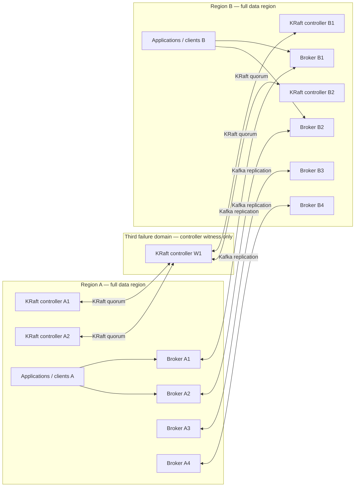
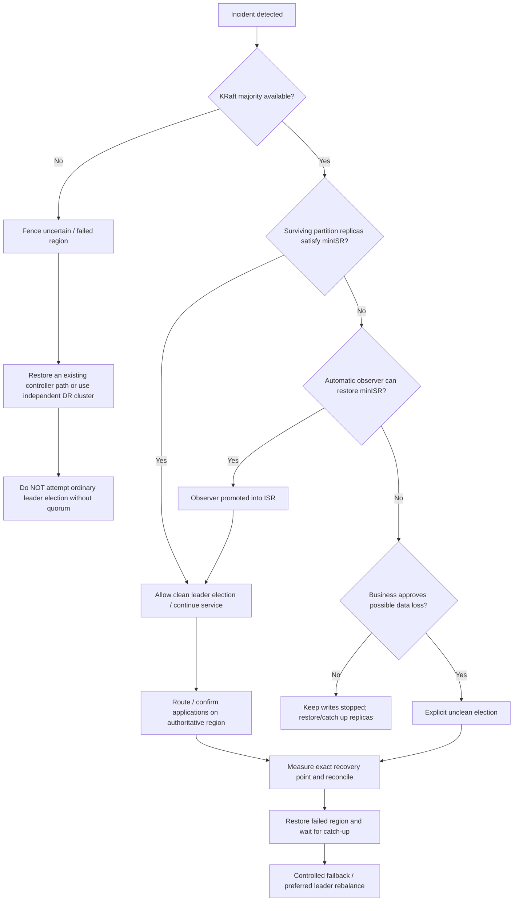

# Disaster Recovery Design and Runbook for Confluent Platform 8.3.0 in a Two-Region Stretched Kafka Cluster

## Executive summary

This report targets **Confluent Platform / Confluent Server Enterprise 8.3.0**, which is based on the Apache Kafka 4.3 generation. The first architectural point is definitive rather than an assumption: **ZooKeeper is not supported in Confluent Platform 8.3.0. KRaft is mandatory.** Confluent removed ZooKeeper beginning with Platform 8.0, and Apache Kafka 4.3 itself is KRaft-only. citeturn14search24turn15view3turn14search6

The second—and most important—finding is that a **strictly two-region stretched Kafka cluster cannot provide symmetric, automatic region-level DR at the KRaft control plane**. KRaft requires a majority of controllers. Confluent explicitly recommends three or more failure domains for Multi-Region Clusters and gives a five-controller `2 + 2 + 1` placement as the preferred 2.5-data-center pattern. For only two sites, Confluent states that a deployment is possible but requires either an asymmetric **3:2 controller split with a preferred datacenter**, or manual KRaft quorum intervention during a network partition. citeturn16view0turn19view1turn15view2

**My primary recommendation is therefore a two-region data plane plus a tiny third KRaft-controller failure domain:** five dedicated controllers placed `2 Region A + 2 Region B + 1 witness`, with Kafka brokers only in A and B. This is still operationally a two-region Kafka data deployment, but it removes the fatal two-site quorum asymmetry: if either data region disappears, the surviving region's two controllers plus the witness form the required 3/5 majority. This is exactly the topology Confluent recommends for a 2.5-DC stretched cluster. citeturn19view1

If a third failure domain is absolutely impossible, use **five dedicated controllers split 3:2**, with Region A explicitly designated the preferred/quorum-majority region. Loss of Region B leaves Region A with 3/5 and the cluster can continue. Loss of Region A leaves Region B with only 2/5: **the Kafka cluster loses its control-plane quorum and cannot safely fail over simply because the data replicas are present in B**. This limitation must appear explicitly in the business DR SLO and runbook. citeturn16view0turn15view2

For brokers, the recommended starting topology is **eight brokers, four per region**, assuming the as-yet-unspecified workload fits on this hardware. Six brokers, three per region, are the minimum practical topology for the strict-RPO placement recommended below, because Confluent's RPO=0 pattern can place two synchronous replicas plus one observer in each region, requiring at least three distinct brokers per rack. Four per region provides a spare placement target during broker maintenance and considerably better operational headroom. Broker count beyond this must ultimately be sized from partition count, retention, disk throughput, peak producer/consumer throughput, and recovery bandwidth; those workload parameters were not specified. Confluent requires enough brokers to satisfy every replica/observer rack constraint. citeturn19view2

For **Tier-0 data requiring RPO=0 across a regional failure**, I recommend the Confluent-documented pattern of:

| Setting | Recommended Tier-0 value |
|---|---|
| Synchronous replicas | 2 in Region A + 2 in Region B |
| Observers | 1 in Region A + 1 in Region B |
| Total copies | 6 |
| `min.insync.replicas` | **3** |
| Producer `acks` | **`all`** |
| Observer promotion | `under-min-isr` |
| Automatic unclean leader election | Disabled |
| Broker racks | `region-a`, `region-b` |

Confluent explicitly states that to guarantee RPO=0 across a data-center failure, `min.insync.replicas` must be **greater than the number of synchronous replicas in any one data center**, and gives exactly the example of two replicas plus one observer per location with `min.ISR=3` and producers using `acks=all`. Automatic observer promotion can then add a surviving local observer to the ISR after a regional failure so the partition can resume satisfying minISR. citeturn19view1turn19view0

This is stronger than the frequently suggested `RF=4, 2+2, minISR=2`. With `minISR=2`, a region isolated from its peer can eventually acknowledge new records using only its two local replicas. Those records would no longer have synchronous cross-region durability. Therefore **2+2/minISR2 is an availability-first design, not the strict regional RPO=0 design** described by Confluent. Apache Kafka also makes clear that `min.insync.replicas` only constrains `acks=all` writes when the ISR has shrunk; while healthy, `acks=all` waits for every current ISR member. citeturn15view5turn19view1

For latency-sensitive data where a small RPO is acceptable, use a different topic class: for example **three synchronous replicas in the active region plus two observers in the remote region, `minISR=2`, `acks=all`**. Because observers do not normally participate in the ISR, remote replication does not delay producer acknowledgment; the trade-off is asynchronous regional replication and therefore RPO greater than zero. citeturn19view0turn19view2

Within the stretched cluster, **do not use MirrorMaker 2, Confluent Replicator, or Cluster Linking for replication between A and B**. The stretched deployment is one Kafka cluster and its native replicas/observers are the replication mechanism; Confluent explicitly notes that Replicator is not needed inside such a stretched cluster. citeturn14search8 For an **independent second DR cluster**, however, Cluster Linking is my preferred Confluent-native protection layer because it mirrors topics byte-for-byte, preserves globally consistent offsets, does not require Connect, and has explicit `promote`, `failover`, and reverse/restore workflows. It is asynchronous, so unlike properly configured synchronous MRC it does not provide RPO=0 by itself. citeturn15view4turn14search7turn14search29

The resulting recommendation is:

**Best architecture:** `4 brokers A + 4 brokers B`, plus `2 controllers A + 2 controllers B + 1 controller witness`, Tier-0 topics with `2 sync + 1 observer per region / minISR3 / acks=all`, capacity in either region for the whole production workload, and—where regional disaster or operator-error protection is critical—an independent Kafka DR cluster fed by Cluster Linking.

**Acceptable strict-two-region fallback:** `4 brokers A + 4 brokers B`, `3 controllers A + 2 controllers B`; document clearly that failure of Region A is **not an ordinary Kafka failover event** and requires restoration of controller quorum or failover to an independent DR cluster.

## Scope, assumptions, and design principles

The following design assumptions are deliberately explicit because the requested workload characteristics were unspecified.

| Parameter | Assumption / status |
|---|---|
| Confluent release | **8.3.0**, Enterprise-capable Confluent Server |
| Kafka generation | Apache Kafka 4.3 generation. citeturn14search24 |
| Metadata mode | **KRaft only**; ZooKeeper is unsupported in CP 8.x. citeturn15view3 |
| Regions | Two full data regions, A and B |
| Third location | Not currently stated; strongly recommended for one controller witness |
| WAN | Described as “very fast”; actual RTT, packet loss and available bandwidth unspecified |
| Workload throughput | Unspecified |
| Partition count | Unspecified |
| Retention/storage | Unspecified |
| Application placement | Assumed deployable in both regions for low RTO |
| RPO/RTO SLO | Unspecified; this report provides Tier-0 RPO=0 and lower-cost alternatives |
| Security | TLS/SASL/RBAC/ACL details unspecified |
| Schema Registry / Connect / ksqlDB | Presence unspecified; DR requirements included where applicable |
| Automation | Manual operator approval is acceptable |
| Capacity philosophy | Each region should be capable of carrying the complete critical workload after failover |

A stretched Kafka cluster solves **high availability**, but it is not, by itself, a complete backup strategy. Synchronous replication immediately propagates legitimate administrative changes, topic deletion, bad records, incorrect retention changes, and many forms of logical corruption to the other region. Confluent's backup guidance favors replication to another Kafka cluster; for true disaster and operator-error protection, an independent cluster with separately controlled retention and credentials is materially stronger than another replica inside the same metadata domain. citeturn6search8turn15view4

There are therefore three different failure domains to design separately:

1. **Data-plane availability** — whether an eligible copy of every partition survives.
2. **Control-plane availability** — whether a majority of KRaft controllers survives.
3. **Application authority** — whether clients, DNS/load balancers, credentials, and external services agree which side is allowed to process writes.

A successful Kafka DR design must satisfy all three. Having complete partition data in Region B does not make B usable when its controllers constitute only 2 of a 5-voter KRaft quorum. Conversely, having a controller quorum does not help a partition for which the surviving data replicas cannot meet its ISR/leader requirements. citeturn15view2turn15view5

Confluent's architecture guidance reflects the same distinction. It recommends a three-data-center stretched cluster only with stable low-latency networking, and recommends a **2.5-DC** pattern specifically so that either full data center can disappear while a KRaft majority remains available. citeturn19view1

A further consequence is that the phrase **“RPO=0” must always identify the failure sequence being protected**. A record acknowledged while both regions are healthy can exist synchronously in both places, yet a configuration that continues acknowledging writes after one region has left the ISR can lose those subsequent records if the surviving side also fails before replication catches up. This is why Confluent's strict regional RPO=0 prescription uses `minISR` greater than the number of synchronous replicas in any one site. citeturn19view1turn15view5

## Recommended architecture and KRaft quorum design

Confluent Platform 8.3.0 should use **dedicated KRaft controllers**, not ZooKeeper and not a ZooKeeper/KRaft migration configuration. ZooKeeper was removed in Platform 8.0. Dynamic KRaft controller configurations are supported in Platform 7.9 and later, and Apache Kafka 4.3 uses `controller.quorum.bootstrap.servers` to discover the controller quorum; the old `controller.quorum.voters` mechanism should not simultaneously be used for a dynamic quorum. citeturn15view3turn15view2turn17search1

For a critical production cluster I recommend separate broker and controller processes/hosts rather than combined roles. Confluent's production KRaft guidance recommends dedicated roles for production rather than combined broker/controller operation, while Apache recommends three or five controllers and explains that three tolerates one controller failure whereas five tolerates two. citeturn2view3turn15view2

The preferred physical design is:



A five-controller quorum requires three votes. In `2+2+1`, loss of A leaves `B1+B2+W=3`; loss of B leaves `A1+A2+W=3`. This is a direct quorum consequence and is the topology Confluent documents for its 2.5-DC architecture. citeturn19view1turn15view2

The witness is **not a broker** and stores no Kafka topic partitions. It does participate in KRaft metadata consensus, so its network path must be stable and low latency. The witness should be placed in a genuinely independent failure domain—different metropolitan facility, availability zone with independent regional failure characteristics, or equivalent—not merely another rack dependent on the same regional routing/power failure. Confluent's 2.5-DC architecture explicitly uses the light site for KRaft controller nodes rather than brokers. citeturn19view1

If only two locations are physically possible, use:

```text
Region A: 3 dedicated KRaft controllers + 4 Kafka brokers
Region B: 2 dedicated KRaft controllers + 4 Kafka brokers
```

Confluent specifically identifies a `3:2` KRaft split as the two-DC alternative. Region A then becomes the **quorum-preferred site**: after an A–B partition A can retain/elect the active controller because it owns 3/5 votes; B cannot. citeturn16view0 This designation should not be confused with Kafka partition preferred leaders; it is a KRaft failure-domain property.

The consequences are important:

| Event in a strict 3:2 layout | Reachable KRaft voters | Quorum? | Cluster control plane |
|---|---:|---:|---|
| One controller fails | 4/5 | Yes | Available |
| Two individual controllers fail | 3/5 | Yes | Available |
| Region B with two controllers fails | 3/5 | Yes | Available |
| A–B network partition, viewed from A | 3/5 | Yes | A becomes authoritative |
| A–B network partition, viewed from B | 2/5 | No | B cannot make metadata progress |
| Region A with three controllers fails | 2/5 | **No** | **Unavailable** |

Apache Kafka states explicitly that five KRaft controllers tolerate two failures and that a majority must remain alive. citeturn15view2

This is why adding *more brokers* to Region B does not fix Region-A DR. Data replicas and controller quorum solve different problems.

For brokers, **four per region is the recommended baseline; three per region is the topology floor for the Tier-0 placement below**. Three brokers are needed because the recommended per-region placement contains three copies of each Tier-0 partition: two synchronous replicas and one observer. Confluent requires at least as many brokers in a rack as the number of replicas plus observers assigned there. citeturn19view2 The fourth broker gives an immediately available target onto which a replica or observer can be reassigned during maintenance or a broker failure. Larger clusters should scale approximately symmetrically—5+5, 6+6, and so forth—according to throughput and partition requirements rather than merely adding replicas.

Each region should also have enough **CPU, NIC, disk throughput, storage and partition capacity to run the entire critical workload after a failover**. If normal traffic is approximately 50/50 active-active, designing each site only for its normal half-load defeats regional DR; after a regional outage the remaining site must absorb approximately twice its previous client workload, in addition to leader movement and subsequent replica recovery. A reasonable engineering capacity rule is:

```text
required_capacity_per_region
    >= peak_total_critical_workload × failover_headroom

where failover_headroom is typically >= 1.2
```

The precise headroom is a local SLO choice rather than a Confluent-defined constant.

For new Platform 8.3 KRaft deployments, use the dynamic quorum mechanism. A representative controller configuration is:

```properties
# controller-a1.properties
process.roles=controller
node.id=101

listeners=CONTROLLER://controller-a1.example.net:9093
controller.listener.names=CONTROLLER

controller.quorum.bootstrap.servers=\
controller-a1.example.net:9093,\
controller-a2.example.net:9093,\
controller-b1.example.net:9093,\
controller-b2.example.net:9093,\
controller-w1.example.net:9093

# Applicable to dynamic-controller deployments
controller.quorum.auto.join.enable=true

metadata.log.dir=/var/lib/kafka/kraft-controller
```

Apache Kafka requires every broker/controller to know the controller bootstrap endpoints, and Confluent supports dynamic controllers on Platform 7.9 and later. citeturn15view2turn15view3 For a strict 3:2 design, replace the witness with `controller-a3`.

A representative broker configuration is:

```properties
# broker in Region A
process.roles=broker
node.id=1

broker.rack=region-a

controller.listener.names=CONTROLLER
controller.quorum.bootstrap.servers=\
controller-a1.example.net:9093,\
controller-a2.example.net:9093,\
controller-b1.example.net:9093,\
controller-b2.example.net:9093,\
controller-w1.example.net:9093

# Local-rack follower fetching
replica.selector.class=org.apache.kafka.common.replica.RackAwareReplicaSelector

# Do not permit automatic data-losing leader election
unclean.leader.election.enable=false
```

Configure Region-B brokers identically except for unique `node.id`, addresses and:

```properties
broker.rack=region-b
```

Confluent MRC uses `broker.rack` for replica-placement constraints and its rack-aware replica selector together with client `client.rack` to allow consumers to fetch locally where possible, which can significantly reduce WAN read traffic. citeturn19view0

KRaft controller election is majority based: one controller is active and the remainder are hot standbys. Apache Kafka 4.3's default `controller.quorum.election.timeout.ms` is 1 second and `controller.quorum.fetch.timeout.ms` is 2 seconds; if the leader cannot communicate successfully with a majority for the fetch-timeout interval, it resigns, while followers initiate elections after the corresponding election conditions. citeturn17search1 Broker failure detection is separately governed by broker-controller heartbeats, and data replicas have their own ISR lag detection; consequently the total user-visible failover time is not simply “one second.”

During a 3:2 inter-region partition, if the former active controller happens to be in B, it cannot retain a majority; A's three voters can elect a controller and continue. KRaft's majority intersection protects metadata from ordinary two-sided split brain, but operational fencing remains advisable because stale applications and external systems may take longer to converge.

**Maintenance rule:** do controller maintenance only with the full quorum healthy. Five controllers tolerate two individual failures, but a `2+2+1` topology after a full regional loss is already at the exact 3/5 majority, as is the A side after losing B in a 3:2 topology. A further controller failure at that point loses quorum. citeturn15view2turn19view1

## Replication, durability, networking, and backup strategy

The preferred topic design should be driven by RPO class rather than applying one replication policy indiscriminately.

For **Tier-0 / strict regional RPO=0**, use this replica-placement file:

```json
{
  "version": 2,
  "replicas": [
    {
      "count": 2,
      "constraints": {
        "rack": "region-a"
      }
    },
    {
      "count": 2,
      "constraints": {
        "rack": "region-b"
      }
    }
  ],
  "observers": [
    {
      "count": 1,
      "constraints": {
        "rack": "region-a"
      }
    },
    {
      "count": 1,
      "constraints": {
        "rack": "region-b"
      }
    }
  ],
  "observerPromotionPolicy": "under-min-isr"
}
```

Create a critical topic using the placement policy rather than specifying `--replication-factor`:

```bash
kafka-topics --create \
  --bootstrap-server broker-a1.example.net:9092 \
  --topic payments \
  --partitions 96 \
  --replica-placement /etc/kafka/placements/tier0-rpo0.json \
  --config min.insync.replicas=3 \
  --config unclean.leader.election.enable=false
```

Confluent warns that when default placement constraints are in use, explicitly specifying `--replication-factor` at topic creation can cause the placement constraints to be ignored. citeturn19view0

The producer side must use:

```properties
acks=all
enable.idempotence=true
bootstrap.servers=broker-a1:9092,broker-a2:9092,broker-b1:9092,broker-b2:9092
```

`acks=all` is essential. Apache Kafka defines `min.insync.replicas` as the minimum ISR required for an `acks=all` write, and while the ISR has four members, an `acks=all` producer waits for all four current ISR replicas rather than merely three. citeturn15view5 Thus the Tier-0 healthy-state producer latency includes cross-region replication latency.

The behavior is:

```text
Healthy:
    Region A: 2 sync ISR + 1 observer
    Region B: 2 sync ISR + 1 observer
    ISR size = 4
    minISR = 3
    acks=all waits for all 4 synchronous ISR copies

Region A failure, with controller quorum still available:
    Region B: 2 sync ISR + 1 observer
    ISR initially falls to 2
    under-min-isr policy promotes the Region-B observer
    ISR returns to 3
    writes can continue

Region B failure:
    symmetric data-plane behavior in Region A
```

Confluent describes automatic observer promotion specifically as allowing observers to enter the ISR when failures push the partition below minISR; recovered followers later rejoin and observers are demoted automatically. citeturn19view0 The crucial caveat is again the control plane: symmetric data recovery only becomes symmetric cluster recovery when the KRaft quorum is also symmetric—hence the 2+2+1 witness recommendation.

For **Tier-1 / latency-first active-passive topics**, use:

```json
{
  "version": 2,
  "replicas": [
    {
      "count": 3,
      "constraints": {
        "rack": "region-a"
      }
    }
  ],
  "observers": [
    {
      "count": 2,
      "constraints": {
        "rack": "region-b"
      }
    }
  ],
  "observerPromotionPolicy": "under-min-isr"
}
```

with:

```properties
min.insync.replicas=2
```

This makes all normal `acks=all` acknowledgments depend only on three Region-A ISR replicas. The two Region-B observers replicate asynchronously and therefore do not add WAN RTT to the acknowledgment path. Confluent documents this exact observer principle: observers copy data but are not normally members of the ISR, so producers do not wait for them. citeturn19view0turn19view2 The cost is **RPO > 0**, bounded operationally by observer lag at failure time.

For ordinary noncritical topics, RF3/minISR2 remains a standard Kafka durability baseline, but it is not inherently a symmetric two-region DR scheme. Apache gives RF3/minISR2/`acks=all` as the typical majority durability pattern. citeturn15view5

Automatic unclean leader election should stay disabled. If all synchronous replicas disappear and only a non-ISR observer remains, Confluent provides an explicit unclean-election procedure, but warns that the chosen observer may lack acknowledged records and that logs may be truncated to its offset. citeturn16view0 Therefore an unclean election belongs behind a human “accept data loss” decision gate, never as a reflexive DR step.

For example:

```json
{
  "version": 1,
  "partitions": [
    {
      "topic": "payments",
      "partition": 0
    }
  ]
}
```

```bash
kafka-leader-election \
  --bootstrap-server broker-b1.example.net:9092 \
  --election-type UNCLEAN \
  --path-to-json-file unclean-election.json
```

Confluent documents that command for observer failover and explicitly warns about possible truncation/data loss. citeturn16view0

The same placement discipline must cover internal state. Confluent provides broker defaults for the normal log placement, consumer-offset topic, and transaction-state topic:

```properties
confluent.log.placement.constraints=<placement-json>
confluent.offsets.topic.placement.constraints=<placement-json>
confluent.transaction.state.log.placement.constraints=<placement-json>
```

However, Confluent warns that Connect, metrics, telemetry, command and various other internal topics do **not** automatically receive the same placement and must be handled separately. citeturn16view0turn19view2 Kafka Connect's production internal topics also normally use replication factor 3 or greater, so their placement must be included in the DR inventory rather than assumed safe merely because user topics are safe. citeturn18search7

For consumers, enable rack locality:

```properties
client.rack=region-a
```

and use `region-b` on B-resident consumers. With Confluent's rack-aware replica selector, this allows local follower fetching when an appropriate replica contains the requested data. citeturn19view0

### Network design

Confluent's general Kafka production guidance says **latency below 30 ms is generally recommended**, while its stretched-cluster architecture requires low, stable latency and describes sub-100-ms networking; its 2.5-DC guidance explicitly says not to use a stretched cluster when network performance exceeds 100 ms, is unstable, or is unknown. citeturn18search2turn19view1

For this design I would operationalize those statements as:

| Network characteristic | Recommended engineering threshold |
|---|---|
| Inter-region RTT p99 | **≤30 ms** |
| Preferred RTT for demanding synchronous Tier-0 traffic | ≤10–20 ms |
| Sustained RTT >30 ms | Warning / capacity and latency review |
| RTT approaching or exceeding 100 ms | **Redesign away from stretched synchronous architecture** |
| Packet loss | Target effectively zero; alert around sustained >0.1% |
| WAN utilization | Keep sufficient spare capacity for normal replication **and catch-up**; avoid sustained saturation |
| p99/p99.9 jitter | Track explicitly; tight tail latency matters more than average |
| Routing failover | Independently tested; no dependency on the failed region |

The 30-ms and 100-ms values come from Confluent guidance; the packet-loss and utilization values above are **house engineering thresholds**, not Confluent product limits. citeturn18search2turn19view1

WAN capacity should be calculated, not guessed. A conservative model for a partition whose leader is in A is:

```text
WAN replication rate
  ≈ compressed_write_rate
    × number_of_B_replica/observer fetchers
    + protocol overhead
```

Tier-0 has three copies in the remote rack—two synchronous replicas and one observer—so leader distribution can materially affect WAN demand. In addition, recovery requires bandwidth beyond live ingestion:

```text
required_catchup_bandwidth
  >= live_replication_rate
     + backlog_bytes / target_catchup_seconds
```

Design so recovery traffic does not consume the last available bandwidth and create a self-sustaining ISR failure.

Kafka 4.3's controller defaults also illustrate why long WAN stalls are dangerous: controller election timeout defaults to 1 second and quorum fetch timeout to 2 seconds. These values should not be casually raised merely to mask an unstable network; repeated KRaft elections are a network/infrastructure incident first and a timeout-tuning problem second. citeturn17search1 Kafka separately removes lagging data replicas from ISR according to `replica.lag.time.max.ms`; the Kafka 4.3 design documentation explains that replicas unable to catch up within that interval cease to be considered in-sync. citeturn17search6

### Backup model

The DR backup should have four layers.

**Configuration and security state.** Store all broker/controller configurations, replica-placement JSON, topic-policy definitions, listener/TLS/SASL settings, DNS/LB configuration, service-account definitions and automation in version-controlled configuration management. Certificates/private keys and passwords belong in the organization's independent secrets/Pki system rather than in an unencrypted Kafka export.

A daily and pre-change logical-state collection can include:

```bash
# KRaft quorum state
kafka-metadata-quorum \
  --bootstrap-controller controller-a1.example.net:9093 \
  describe --status

kafka-metadata-quorum \
  --bootstrap-controller controller-a1.example.net:9093 \
  describe --replication

# Topics / partition assignments
kafka-topics \
  --bootstrap-server broker-a1.example.net:9092 \
  --describe

# Topic and other dynamic configurations
kafka-configs \
  --bootstrap-server broker-a1.example.net:9092 \
  --entity-type topics \
  --describe --all

# ACL state
kafka-acls \
  --bootstrap-server broker-a1.example.net:9092 \
  --list

# Consumer offset state / lag
kafka-consumer-groups \
  --bootstrap-server broker-a1.example.net:9092 \
  --all-groups \
  --describe
```

KRaft metadata itself is replicated through the controller quorum. The operational DR mechanism should **not** be “copy a live controller `metadata.log.dir` occasionally and hope it can be restored.” Use replicated controllers, reproducible logical configuration, validated storage recovery procedures, and an independent data replica/cluster. Apache Kafka exposes `kafka-metadata-quorum` specifically for inspecting quorum status and replication. citeturn15view2turn17search4

**Consumer and transactional state.** Protect `__consumer_offsets` and the transaction state log with deliberate region placement, not only with their default RF. Confluent exposes dedicated placement constraints for both. citeturn16view0

**Application metadata.** If Kafka Connect is used, back up/reproduce connector definitions and place its config, offset and status topics appropriately. If Schema Registry is used and a second independent DR cluster exists, Schema Linking is preferable to treating `_schemas` as an ordinary manually copied file; Confluent supports Schema Linking for DR-style schema replication. citeturn6search18 Similar application-specific inventories are required for ksqlDB and Kafka Streams internal topics.

**Independent event-data copy.** For failures such as accidental deletion, security compromise, catastrophic quorum loss, or a disaster affecting both stretched-cluster halves logically, maintain a second Kafka cluster where business criticality warrants it. Confluent describes a second cluster plus data replication as the preferred way to protect Kafka data, and Cluster Linking is purpose-built for cross-cluster DR. citeturn6search8turn15view4

## Monitoring and operational guardrails

Confluent says that, at minimum, `ActiveControllerCount`, `OfflinePartitionsCount`, and `UncleanLeaderElectionsPerSec` should be monitored and alerted. Kafka 4.3 additionally exposes KRaft quorum state, current leader, commit/election latency, fenced brokers, metadata processing lag and controller-election counters. citeturn17search0turn17search4

For a stretched cluster, the monitoring baseline should be broader:

| Signal | Proposed alert | Meaning / required action |
|---|---|---|
| `ActiveControllerCount` | **Critical if cluster-wide active count != 1** | No controller or inconsistent monitoring view |
| KRaft `Current Leader` | Critical if `-1` beyond a short election window | Quorum cannot establish leader |
| `NewActiveControllersCount` | Warning on any change outside maintenance | Controller election occurred |
| KRaft max commit/election latency | Warn on sharp deviation from baseline | WAN/controller I/O degradation |
| `LastAppliedRecordLagMs` | Warn if standby lag grows persistently | Controller metadata follower falling behind |
| `FencedBrokerCount` | Alert if not explained by maintenance | Broker lost controller session / availability |
| `OfflinePartitionsCount` | **Critical if >0** | At least one partition lacks an online leader |
| `UncleanLeaderElectionsPerSec` | **Critical if >0** | Potential acknowledged-data loss |
| ISR count < topic minISR | **Critical** | Writes with `acks=all` will fail |
| ISR count == minISR | Warning | No remaining replica failure margin |
| Under-replicated partitions | Warning immediately; escalate if persistent | Replica failure or WAN/capacity issue |
| `IsNotCaughtUp=1` | Warning, critical for DR observers if persistent | Failover copy is lagging |
| `CaughtUpReplicasCount` | Must satisfy DR policy | Number of replicas/observers capable of clean recovery |
| `ObserversInIsrCount` | Incident/degraded-state indicator | Observer promotion has occurred |
| Producer `NotEnoughReplicas*` errors | Critical for Tier-0 | Durability policy can no longer be satisfied |
| Producer p95/p99 latency | Baseline + SLO alert | Often first symptom of WAN deterioration |
| Consumer lag | SLO dependent | Application recovery issue |
| Disk capacity / I/O latency | Alert before saturation | Kafka recovery is disk-intensive |
| WAN RTT p50/p95/p99/p99.9 | p99 >30 ms warning | Stretched-cluster latency risk |
| Packet loss/retransmits | Any sustained rise | ISR/controller instability risk |
| WAN bandwidth | Alert before saturation | Prevent observer/replica catch-up failure |
| External Cluster Linking lag | RPO-budget dependent | Actual cross-cluster recovery point |

The MRC-specific metrics `ReplicasCount`, `ObserverReplicasCount`, `InSyncReplicasCount`, `CaughtUpReplicasCount`, `IsNotCaughtUp`, and `ObserversInIsrCount` are explicitly exposed by Confluent for this purpose. citeturn16view0 Kafka's KRaft monitoring additionally exposes current Raft state/leader, high watermark, commit latency, election latency, metadata lag, fenced broker count and timed-out broker heartbeat counters. citeturn17search4

A particularly valuable **DR readiness KPI** is not simply “cluster green” but:

```text
percentage of Tier-0 partitions for which:
    sync replica count is healthy
AND both regional observers are caught up
AND controller quorum is fully healthy
```

That should normally be 100%. A cluster can have no offline partitions yet still be unready for a regional disaster because observers are hours behind.

Similarly, monitor **estimated catch-up time** rather than raw byte lag alone:

```text
estimated_recovery_seconds
  = replica_backlog_bytes
    / (observed_replication_throughput - current_live_write_rate)
```

When the denominator approaches zero, the replica is technically “replicating” but can never catch up; that is a DR-critical condition.

Operationally, define the following incident gates:

**Green:** five controllers reachable, no offline partitions, all Tier-0 observers caught up, WAN p99 within target.

**Yellow:** one controller/broker unavailable, ISR at minISR, observer lag, persistent WAN >30 ms, or any unexpected controller election.

**Red:** no KRaft leader, <3/5 controllers reachable, offline Tier-0 partition, unexpected unclean leader election, or both copies of an authority/fencing mechanism disagree on the active region.

During Yellow/Red conditions, suspend automatic rebalancing and nonessential partition reassignment unless the runbook specifically requires it; replica movement can consume exactly the disk and WAN capacity needed for recovery.

## Disaster-recovery runbook

The core failover decision must be **quorum first, data second, routing third**:



This order reflects KRaft's majority requirement and Confluent's distinction between clean failover and explicit unclean observer election. citeturn15view2turn16view0

### Common incident preamble

For every region-level incident:

1. **Declare one incident commander** and suspend planned broker/controller maintenance, topic deletion, placement changes and bulk rebalancing.
2. **Identify the active KRaft quorum**:

```bash
kafka-metadata-quorum \
  --bootstrap-controller controller-a1.example.net:9093 \
  describe --status
```

and, where reachable:

```bash
kafka-metadata-quorum \
  --bootstrap-controller controller-b1.example.net:9093 \
  describe --status
```

3. Confirm that exactly one active controller exists and at least three of five configured voters form the current quorum. Apache requires a majority for availability. citeturn15view2turn17search4
4. **Fence the non-authoritative or uncertain side** at the client layer before any forced recovery. Recommended independent fences are application shutdown/service discovery, load-balancer/DNS withdrawal, and producer credential/ACL revocation where operationally feasible.
5. Check the data plane:

```bash
kafka-topics \
  --bootstrap-server broker-a1.example.net:9092 \
  --describe
```

Inspect `Leader`, `Replicas`, `Isr`, `Offline`, and observer state, plus the MRC caught-up metrics. citeturn16view0
6. Record the latest successfully acknowledged canary/event IDs before modifying anything. This is the evidence needed to calculate actual RPO.
7. Do **not** lower `min.insync.replicas` as an ordinary failover action. Lowering it changes the durability contract at exactly the moment the cluster is least redundant.
8. Use an explicit “possible data loss accepted” approval before any unclean election.

### Loss of the minority Region B in a strict 3:2 controller design

Expected controller state:

```text
Controllers A: 3 reachable
Controllers B: 0 reachable
Reachable = 3/5 → quorum survives
```

The KRaft control plane should remain available because the required majority is still present. citeturn15view2turn16view0

For Tier-0 topics, B's two synchronous replicas disappear from ISR. A retains two synchronous replicas and one local observer. Since `minISR=3`, automatic `under-min-isr` observer promotion should promote A's observer into the ISR and allow the partition to remain/resume writable, assuming that observer is sufficiently caught up and the controller remains healthy. citeturn19view0turn19view1

Runbook:

1. Confirm KRaft reports a valid leader and 3/5 voters.
2. Remove/fence Region-B application endpoints.
3. Confirm no `OfflinePartitionsCount`.
4. Verify each critical partition obtains a Region-A leader.
5. Verify `InSyncReplicasCount >= 3` after observer promotion.
6. Confirm `ObserversInIsrCount` reflects the expected degraded state.
7. Send a controlled Tier-0 canary with `acks=all`.
8. Consume the canary from an A-resident consumer and verify sequence continuity.
9. Keep all discretionary broker/controller maintenance frozen: the cluster is already degraded.
10. Capacity-check A before releasing all B application traffic to it.

**Pass condition:** writes and reads succeed, no offline partitions, KRaft 3/5, no unexpected unclean leader election, and no gap between last pre-failure acknowledged Tier-0 event and recovered stream.

### Loss of the majority Region A in a strict 3:2 controller design

Expected controller state:

```text
Controllers A: 0
Controllers B: 2
Reachable = 2/5 → NO quorum
```

Even though Region B may physically possess two synchronous copies plus an observer for every Tier-0 partition, there is no KRaft majority able to commit metadata changes, promote replicas or provide a healthy Kafka control plane. This is the core limitation of the strict two-region topology. citeturn15view2turn16view0

Runbook:

1. Fence Region A's client/application endpoints and establish whether A is truly failed or merely unreachable.
2. Verify B cannot see a KRaft majority; do not treat existing partition data as a writable independent Kafka cluster.
3. **Do not format new controllers or create a new KRaft cluster using B's brokers while the old Region-A controllers might return.**
4. Attempt to restore network access to at least one existing Region-A controller or recover an existing controller instance/storage sufficiently to return to 3/5.
5. Once 3/5 is restored, verify KRaft metadata replication before making topic changes.
6. If restoration of the old quorum is impossible within the RTO, activate the **independent DR Kafka cluster**, if provisioned, rather than improvising a minority-quorum rewrite.
7. For a catastrophic loss of a majority of KRaft controller metadata, invoke the tested Confluent-supported metadata/quorum recovery procedure appropriate to the actual surviving disks/version. This should be treated as a metadata-quorum disaster, not a routine broker failover.
8. Only after quorum recovery should B's partition leadership and observer promotion be evaluated.

There is deliberately no “force the 2/5 minority to become the new quorum” command in this normal runbook. Ordinary dynamic quorum membership changes themselves require a functioning quorum to commit their metadata. A hastily reformatted quorum risks creating two incompatible cluster histories if A later returns.

**Expected RTO in this topology:** potentially far longer than ordinary Kafka leader failover and dependent on restoration of controller quorum. Therefore a strict 3:2 topology cannot honestly claim symmetric region-level RTO.

### Loss of either region with the recommended 2+2+1 controller witness

If A disappears:

```text
B1 + B2 + Witness = 3/5
```

If B disappears:

```text
A1 + A2 + Witness = 3/5
```

Confluent's 2.5-DC design explicitly exists so that the KRaft quorum remains available after any one data center fails. citeturn19view1

Runbook:

1. Confirm `3/5` KRaft voters and one active controller.
2. Fence failed-region application endpoints.
3. Confirm surviving synchronous replicas and automatic local-observer promotion.
4. Verify no offline partitions and `ISR >= minISR`.
5. Produce/consume Tier-0 canaries.
6. Shift application traffic to the surviving region if it was not already active.
7. Monitor CPU, disk and NIC saturation during the full-workload interval.
8. Freeze controller maintenance until the failed region returns.

With applications already running in both sites and proper observer promotion, Confluent describes this architecture as supporting near-zero RTO and RPO=0 depending on replication configuration. citeturn19view1 In operational planning, I would use an initial **10–60 second failover target** for covered Kafka failures and then replace that estimate with measured drill results. This is an engineering target, not a vendor guarantee.

### Partial A–B network partition

First distinguish an actual region outage from a communication partition.

In strict `3:2`, A is authoritative because its three controllers can form a majority. B's two controllers cannot independently commit a competing metadata history. In a 2+2+1 topology, whichever region still has connectivity to the witness can form three votes; if the witness remains connected to both, normal Raft rules determine the active quorum. citeturn15view2turn19view1

Runbook:

1. Inspect KRaft `Current Leader`, epoch and reachable voter state from both sides.
2. Fence client writes from the side that cannot reach the current majority.
3. Do not lower minISR to keep both sides independently writable.
4. Check whether remote replicas have exited ISR.
5. For Tier-0 topics, expect local observer promotion if the authoritative side falls below minISR.
6. Watch `TimedOutBrokerHeartbeatCount`, `FencedBrokerCount`, KRaft election count, ISR shrink events and WAN loss/RTT. citeturn17search4
7. Do not trigger broad reassignments immediately for a short partition; they create unnecessary disk/WAN load.
8. Repair routing.
9. Wait for all returning replicas/observers to become caught up.
10. Only then re-enable clients in the formerly isolated region.

Confluent specifically warns that even a 2.5-DC arrangement may need manual operator action where broker connectivity is partitioned while controller connectivity remains intact, despite automatic observer promotion. citeturn15view0turn19view1 This scenario must therefore be included in regular chaos testing.

### Split-brain response

Under an ordinary KRaft network partition, a correctly configured single cluster's majority quorum is designed to prevent two independent metadata leaders from making committed progress. The more realistic “split brain” risk is **operational**: applications write to an independently promoted DR cluster while producers remain alive against the old cluster, or an administrator attempts to create a second quorum from minority nodes. KRaft majority rules provide the first line of defense, but fencing provides the business-level guarantee. citeturn15view2

Use this order:

1. **Fence source writers.**
2. Confirm fencing through at least two controls—for example application/service discovery plus credentials/network ACLs.
3. Establish one authoritative Kafka cluster/region.
4. Only then promote or fail over a replicated DR copy.
5. Record the exact source and destination high-water marks.
6. Do not reverse traffic until duplicate/missing-event reconciliation is complete.

For Cluster Linking, planned migration should use `promote`, which performs additional checks; emergency DR uses `failover`, which converts the mirror immediately and intentionally does not perform those extra checks or synchronization. citeturn14search15

Planned:

```bash
kafka-mirrors \
  --promote \
  --topics payments orders \
  --bootstrap-server dr-broker.example.net:9092
```

Emergency:

```bash
kafka-mirrors \
  --failover \
  --topics payments orders \
  --bootstrap-server dr-broker.example.net:9092
```

Confluent supports `truncate-and-restore` and reverse operations to establish mirroring in the opposite direction after promotion/failover; simply changing DNS back without reconciling the source is not a safe failback procedure. citeturn14search7turn14search23

### Recovery and failback to a repaired region

After A or B returns:

1. Bring KRaft controllers back **one at a time**.
2. After each controller, inspect:

```bash
kafka-metadata-quorum \
  --bootstrap-controller controller-a1.example.net:9093 \
  describe --replication
```

3. Do not continue if controller metadata lag is increasing or a new election loop begins.
4. Start brokers in controlled batches.
5. Monitor `CaughtUpReplicasCount`, `IsNotCaughtUp`, ISR membership, disk load and WAN bandwidth.
6. Do not send significant client traffic to the recovered region merely because broker TCP ports are open.
7. Wait until Tier-0 placement is restored: all four normal synchronous replicas healthy and observers caught up.
8. Verify all internal topics as well as business topics.
9. Return application traffic gradually.
10. Move leaders only if operationally desirable.

Confluent provides the preferred-leader command:

```bash
kafka-leader-election \
  --bootstrap-server broker-a1.example.net:9092 \
  --election-type preferred \
  --all-topic-partitions
```

and documents it as a failback mechanism after the preferred brokers recover. citeturn16view0 For very large partition counts, execute leader movement in controlled batches rather than inducing an avoidable simultaneous load spike.

**Failback verification checklist:**

```text
[ ] 5/5 controllers healthy and metadata caught up
[ ] Exactly one active KRaft controller
[ ] 0 offline partitions
[ ] 0 unexpected under-replicated Tier-0 partitions
[ ] Tier-0 ISR = expected normal state
[ ] Both regional observers caught up
[ ] No unclean leader election occurred unexpectedly
[ ] Consumer groups stable
[ ] Connect / Schema Registry / other component state verified
[ ] WAN RTT/loss/bandwidth back to green
[ ] Producer/consumer canaries continuous
[ ] Independent DR replication lag back inside RPO objective
[ ] Only then remove incident/change freeze
```

## Validation, replication-option comparison, and final runbook

DR is not validated by checking that Kafka processes restart. It must demonstrate **acknowledged-record survival, control-plane authority, client recovery, and repeatable failback**.

For every drill, run a continuous synthetic producer using `acks=all` and monotonically increasing sequence numbers plus timestamps. Record each successfully acknowledged sequence outside Kafka. On the consumer side, measure the highest contiguous recovered sequence. Then:

```text
RPO = timestamp(last acknowledged event before outage)
      - timestamp(last event present after recovery)

RTO = first successful post-failure application operation
      - failure injection time
```

For strict RPO=0 tests, every successfully acknowledged Tier-0 sequence must reappear after recovery with no missing ID. This method is materially more meaningful than merely observing that `OfflinePartitionsCount` returns to zero.

The minimum validation program should be:

| Test | Injection | Expected outcome | Pass criterion |
|---|---|---|---|
| Single broker loss | Kill one broker in A | Leaders/ISR recover; no Tier-0 loss | No offline partition beyond normal election transition; canaries continuous |
| Broker maintenance | Rolling restart A and B brokers | No availability impact | `acks=all` succeeds; placement restored after each step |
| One controller loss | Stop one of five | No service loss | 4/5 remaining; one active controller |
| Two controller loss | Stop two controllers while preserving three reachable | Quorum survives | Metadata changes and produce/consume work |
| Minority B outage in 3:2 | Isolate all B nodes | A remains authoritative | 3/5 quorum; Tier-0 observer promotes; RPO=0 |
| Majority A outage in 3:2 | Isolate all A nodes | **Cluster becomes unavailable** | Test passes only if B does *not* become independently writable |
| A outage in 2+2+1 | Isolate A | B+witness continue | 3/5; Tier-0 clean continuity |
| B outage in 2+2+1 | Isolate B | A+witness continue | Same symmetric result |
| Broker-only A–B partition | Block broker WAN, preserve relevant controller links | Alerts fire; authoritative side remains controlled | No double authority; documented manual recovery succeeds |
| WAN latency | Inject 10, 20, 30, 50, 100-ms RTT | Tier-0 producer latency increases; alerts before instability | Empirical latency curve and documented maximum accepted RTT |
| WAN packet loss | Inject controlled 0.1–1% loss | Alerts, possible ISR effects at higher loss | No unnoticed DR-readiness degradation |
| WAN bandwidth restriction | Throttle link | Observer/replica lag visible | Catch-up-time alert correctly predicts violation |
| Observer promotion | Remove enough normal replicas to go under minISR | Local observer joins ISR | `ObserversInIsrCount` changes and writes resume |
| Unclean election lab test | Deliberately lag observer then fail normal replicas | Measurable data truncation possible | Runbook calculates exact lost acknowledged range |
| Controller restart/recovery | Restart/rebuild one controller under healthy quorum | Controller catches metadata up | Quorum replication fully catches up before next action |
| Backup reconstruction | Build clean test cluster from exported config/IaC | Logical state reproduced | Topic configs, ACLs, placement and apps match expected state |
| Cluster Linking planned DR | Stop writers, wait lag zero, `promote` | Destination writable | Zero missing acknowledged canaries |
| Cluster Linking emergency DR | Fail source with nonzero lag, `failover` | Destination writable with bounded loss | Actual loss ≤ measured pre-failover replication lag |
| Full failback drill | Restore failed site and return service | No dual writes or gaps | All normal placement/monitoring checks green |

The deliberately counterintuitive **“majority A outage in 3:2” test is mandatory**. A successful result is that B does *not* magically become writable. This demonstrates that operations staff understand the fundamental quorum limitation before discovering it during a real disaster. Confluent explicitly documents the 3:2 preferred-site behavior, while Apache requires a majority of KRaft voters. citeturn16view0turn15view2

The WAN test should also establish the actual operating limit rather than assuming the phrase “very fast network” is sufficient. Confluent recommends below 30 ms generally for Kafka and rejects unstable or greater-than-100-ms networking for its 2.5-DC stretched-cluster architecture. citeturn18search2turn19view1

### Replication and DR option comparison

The following RTO/RPO numbers are **planning estimates, not Confluent guarantees**. They assume the destination capacity is already provisioned, applications are preconfigured for the target, operators are available, routing can change within roughly a minute, and replication lag is actively monitored.

| Technology | Appropriate use here | Data / offsets behavior | Advantages | Main disadvantages | Planning RPO | Planning RTO |
|---|---|---|---|---|---:|---:|
| **Native Confluent MRC synchronous replicas + observers** | **Primary mechanism inside the stretched cluster** | Same Kafka log; normal replicas preserve exact offsets; observers can auto-promote. citeturn19view0 | Can achieve RPO=0; no second-cluster replication stack; very fast partition failover | WAN in synchronous write path; one metadata domain; requires controller quorum; stretched networking constraints | **0** for properly configured Tier-0 | Seconds to ~1 min when quorum survives |
| **MRC local sync replicas + remote observers** | Latency-sensitive active/passive topics | Remote copy asynchronous. citeturn19view0 | Normal produce latency avoids WAN acknowledgement; simple one-cluster model | RPO >0; observer lag must be monitored; controller-quorum limitation remains | Seconds to minutes, bounded by observer lag | Seconds–minutes if quorum survives |
| **Cluster Linking** | **Preferred independent-cluster DR option for Confluent Enterprise** | Byte-for-byte mirror topics with globally consistent offsets; no Connect required. citeturn15view4 | Exact offsets; built into Confluent Server; explicit promote/failover/reverse workflows; less moving infrastructure | Asynchronous; not RPO=0 out of the box; requires second cluster/capacity/license | Typically seconds–minutes depending lag | Commonly a few minutes with pre-staged apps/routing |
| **Confluent Replicator** | Independent cluster where Connect-based transformation/migration capabilities are useful | Connect-based replication; supports topic/data/config replication and consumer-offset translation mechanisms. citeturn6search7turn6search2 | Mature Confluent ecosystem; useful migration/integration functionality; flexible | Connect worker infrastructure; more components; offset handling less transparent than byte-identical Cluster Linking | Seconds–minutes | ~5–20+ min |
| **MirrorMaker 2** | Open-source / portability-oriented independent DR | Connect-framework mirroring of topics, configs, consumer groups and checkpoints. citeturn7search0 | Apache Kafka native/open ecosystem; no Confluent-specific replication feature required; scalable | Operational Connect complexity, topic naming/checkpoint management; more failover tooling required | Seconds–minutes | ~5–30+ min |

Confluent Platform 8.3 documentation notes that MirrorMaker 2 is supported as a standalone executable in its support model, while Confluent points customers to Replicator, Cluster Linking, and Schema Linking for more complete replication solutions. citeturn15view3

Cluster Linking is particularly attractive for this design's **second line of defense** because mirror topics maintain the same offsets and content, avoiding offset translation at failover. Confluent distinguishes planned `promote` from emergency `failover`: `promote` performs verification/final operations, whereas `failover` immediately makes the destination writable without those checks. citeturn15view4turn14search15 Cluster Linking remains asynchronous and Confluent explicitly says it has no out-of-the-box RPO=0 mode; the actual RPO is therefore replication lag at the disaster boundary. citeturn14search29

Replicator is useful where an organization already operates Kafka Connect heavily or needs its broader migration capabilities, while MirrorMaker 2 remains the most portable Apache solution. Neither should be inserted between A and B inside the stretched cluster; Confluent explicitly states that Replicator is not needed for a stretched MRC because the two regions are part of one Kafka cluster. citeturn14search8

### Concise production runbook

The following is the version suitable for an operations console:

```text
INCIDENT

1. Freeze changes, rebalancing, maintenance and topic deletion.

2. QUORUM FIRST:
   kafka-metadata-quorum --bootstrap-controller <ctrl> describe --status

   Require:
   - one active controller
   - >= 3/5 reachable KRaft voters

3. FENCE:
   Ensure only one region/cluster is allowed to receive application writes.
   Use LB/service discovery + an independent network/credential fence.

4. DATA:
   kafka-topics --bootstrap-server <broker> --describe

   Require Tier-0:
   - a leader
   - ISR >= 3
   - no unexpected unclean election
   - observer caught-up state known

5. IF ISR < 3:
   - wait for automatic under-min-isr observer promotion
   - DO NOT lower minISR routinely

6. IF NO QUORUM:
   - do not attempt normal partition failover
   - restore an existing controller/quorum path
   - or activate the independent DR cluster
   - do not format a competing quorum

7. IF ONLY NON-ISR DATA SURVIVES:
   unclean election requires explicit DATA-LOSS APPROVAL.

8. ROUTE clients only after quorum + partition checks pass.

9. VERIFY:
   - exactly one ActiveController
   - OfflinePartitionsCount = 0
   - Tier-0 ISR >= 3
   - canary produce with acks=all succeeds
   - canary consume is sequence-contiguous
   - consumer offsets/application state valid

10. RECOVER:
    controllers first, then brokers in controlled batches.

11. WAIT:
    all sync replicas and observers fully caught up.

12. FAIL BACK:
    gradually restore client traffic;
    perform controlled preferred-leader election if desired.

13. CLOSE INCIDENT only after:
    5/5 controllers healthy,
    normal placement restored,
    observer lag zero/acceptable,
    external DR replication back inside RPO,
    WAN and capacity green.
```

### Final design decision

For the stated two-region environment, the strongest defensible production design is:

**Control plane**

```text
5 dedicated KRaft controllers
2 Region A
2 Region B
1 independent witness location
```

This follows Confluent's documented 2.5-DC pattern and allows either full data region to fail while preserving 3/5 quorum. citeturn19view1

**Data plane**

```text
Recommended baseline: 8 brokers
4 Region A
4 Region B

Minimum topology floor for the Tier-0 policy:
3 Region A
3 Region B
```

The exact count above eight should be capacity-driven. Each region must independently support the full failed-over workload.

**Tier-0 topics**

```text
2 synchronous replicas Region A
2 synchronous replicas Region B
1 observer Region A
1 observer Region B

min.insync.replicas=3
acks=all
observerPromotionPolicy=under-min-isr
unclean.leader.election.enable=false
```

This aligns with Confluent's documented RPO=0 reasoning: minISR must exceed the number of normal replicas in any single region. citeturn19view1turn19view0

**Tier-1 latency-sensitive topics**

```text
3 synchronous replicas active region
2 observers remote region
min.insync.replicas=2
acks=all
observerPromotionPolicy=under-min-isr
```

This avoids WAN acknowledgment latency in the healthy write path but deliberately accepts RPO greater than zero because the remote observers are asynchronous. citeturn19view0

**Network**

```text
Target p99 RTT <= 30 ms
Prefer <= 10–20 ms for demanding synchronous Tier-0 workloads
Do not approve stretched architecture at >=100 ms or unstable WAN
Continuously monitor p99/p99.9 latency, packet loss and catch-up bandwidth
```

Confluent's official references support <30 ms as the general Kafka latency recommendation and <100 ms/stable networking as the stretched-cluster envelope. citeturn18search2turn19view1

**Secondary DR**

Use **Cluster Linking to a physically and administratively independent Kafka cluster** when the required disaster model includes destruction of the KRaft majority, logical corruption/operator error, or a regional catastrophe beyond what the stretched cluster itself can isolate. Cluster Linking's byte-for-byte mirrors and offset preservation make it the preferred Confluent-native option, while its asynchronous nature means RPO must be monitored from actual link lag. citeturn15view4turn14search29

If the third controller witness is prohibited and the architecture must remain exactly two physical regions, retain the **five-controller 3:2 design only with an explicit asymmetric DR statement**:

> Region B failure is a normal Kafka HA event; Region A failure is a KRaft-quorum disaster unless an independent DR cluster is available.

That conclusion follows directly from Confluent's documented 3:2 two-datacenter model and Kafka's requirement that a majority of KRaft controllers remain alive. citeturn16view0turn15view2

The most important primary documentation for implementing and validating this design is Confluent's **Configure Multi-Region Clusters** guide, including replica placement, automatic observer promotion, internal-topic placement, 3:2 two-DC quorum behavior and observer failover. citeturn19view0turn16view0 Confluent's **Multi-Datacenter Architectures** guide supplies the 2.5-DC design, RPO=0/minISR rule and five-controller `2+2+1` placement. citeturn19view1 Apache Kafka's **KRaft** documentation defines the controller-majority behavior and 3/5-controller failure tolerance. citeturn15view2 Apache's broker configuration reference defines the exact `acks=all`/`min.insync.replicas` semantics. citeturn15view5 Confluent's **Cluster Linking** documentation provides the preferred independent-cluster DR mechanism and its promotion/failover workflow. citeturn15view4turn14search15